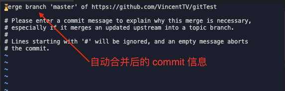
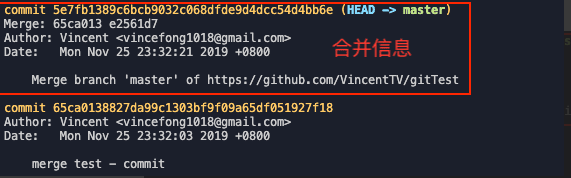
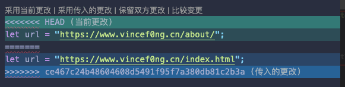
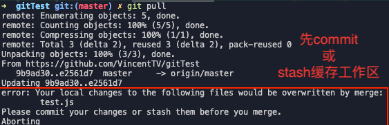
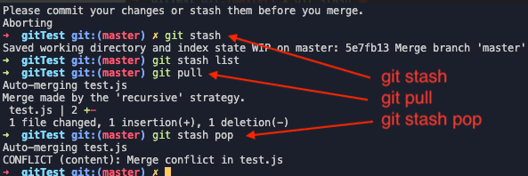

[TOC]

Git 是一个分布式版本控制系统，不同类型的版本控制软件还有 svn，mercurial，vss，SourceAnywhere 等。

这里总结一些平时常用的指令

### 初始化

- `git init`：初始化当前目录
- `git init [name]`：指定目录初始化
- `git clone [url]` ：克隆项目

### 配置

- `git config user.name [name]` :   项目配置，用户名；
- `git config user.email [email]` : 项目配置，用户邮箱；
- `git config --global user.name [name]` : 全局配置，用户名；
- `git config --global user.email [email]` : 全局配置，用户邮箱；
- `git config --list` : 查看当前 git 配置；

### 基本操作

#### `git status`

该命令用于查看项目的当前状态。

```
# 工作区状态
$ git status

# 加 -s 简短结果输出
$ git status -s
```

#### git add

该命令可将该文件添加到缓存区。

- `git add [file/dir]` : 添加文件或目录到缓存区；
- `git add .` 或 `git add -A` : 添加所有文件

#### git commit

该命令可将提交暂存区到仓库区。

- `git commit -m [message] `: 提交暂存区所有文件；
- `git commit [file1] [file2] -m [message]` : 指定文件提交；
- `git commit -a -m [message]` : 直接从工作区提交到仓库区;

### git rm

该命令可将文件从工作区、缓存区移除。

如果只是简单地从工作目录中手动删除文件，运行 git status 时就会有 Changes not staged for commit 的提示。

```shell
# 从已跟踪文件清单中移除
$ git rm [file]

# 已提交暂存区，则必须要用强制删除 -f
$ git rm -f [file]

# 移除暂存区，并保留在工作区中
$ git rm --cached [file]

```

#### git diff

该命令显示已写入缓存与已修改但尚未写入缓存的改动的区别。

```shell
# 显示暂存区和工作区的差异
$ git diff

# 显示暂存区和上一个commit的差异
$ git diff --cached [file]

# 显示工作区与当前分支最新commit之间的差异
$ git diff HEAD

# 显示两次提交之间的差异
$ git diff [first-branch]...[second-branch]

# 显示今天你写了多少行代码
$ git diff --shortstat "@{0 day ago}"

```

### 分支管理

- `git branch`
- `git checkout`
- `git merge`

#### 查看分支

```shell
# 列出所有本地分支
$ git branch

# 列出所有远程分支
$ git branch -r

# 列出所有本地分支和远程分支
$ git branch -a

```

#### 新建分支

```shell
# 新建一个分支
$ git branch [branch-name]

# 新建一个分支，并切换到该分支
$ git checkout -b [branch]

```

#### 切换分支

```shell
# 切换到指定分支，并更新工作区
$ git checkout [branch-name]

# 切换到上一个分支
$ git checkout -

```

#### 合并分支

```shell
# 合并指定分支到当前分支
$ git merge [branch]

# 选择一个commit，合并进当前分支
$ git cherry-pick [commit]

```

#### 删除分支

```shell
# 删除分支
$ git branch -d [branch-name]

# 删除远程分支
$ git push origin --delete [branch-name]
$ git branch -dr [remote/branch]
```

### 查看历史及版本操作

#### 历史记录

```shell
# 显示当前分支的版本历史
$ git log

# 显示当前分支的历史记录的简洁的版本
# 可添加 --reverse 参数来逆向显示
$ git log --oneline

# 显示commit历史，以及每次commit发生变更的文件
$ git log --stat

# 搜索提交历史，根据关键词
$ git log -S [keyword]

# 显示最近几次版本历史
$ git reglog


```

#### 版本操作

```shell
# 版本操作
$ git reset --hard [HEAD值]

# 只能回退，一个^代表一个版本
$ git reset --hard HEAD^

# 只能回退，数字代表几个版本
$ git reset --hard HEAD~2

```

### 远程仓库

初始化

- `git remote -v` : 查看；
- `git remote add [remote-name] [url]` : 查看；

```shell
# 查看
$ git remote -v

# 初始化
$ git remote add origin https://github.com/VincentTV/before-after-slider.git
```

### ssh key

创建公钥（需先配置全局用户）
添加密钥在 push 时可以不用密码验证，也可使用 ssh 关联远程仓库。

- ssh-keygen -t rsa : 生成密钥；
- ssh-keygen -t rsa -C [email-address] : 可在密钥中添加邮箱信息；
- 生成的密钥在用户根目录下的 ~/.ssh 目录中，id_rsa为你的私钥（不要随便给别人），id_rsa.pub为你的公钥。

```shell
$ cd ~
$ ssh-keygen -t rsa
$ cd .ssh
$ cat id_rsa.pub
# 创建密钥->复制公钥
```

Github 添加密钥
`github->settings->SSH and GPGkeys->new ssh key->输入公钥`

#### 推送

```shell
$ git push [remote-name] [branch-name]
```

#### 下载

```shell
# 抓取远程文件,不改动本地工作区文件
$ git fetch [remoteName] [BranchName]

# 切换抓取的远程分支
$ git checkout [remoteName/BranchName]

# 合并
$ git merge [remoteName/BranchName]

# 抓取并合并，相当于执行了 fetch 和 merge
$ git pull [remoteName] [BranchName]

```

### 问题总结

#### 冲突解决

场景一：本地和远程在同个 HEAD 后都有 commit

场景说明：A 与 B 同时操作了同个 HEAD，无论谁先 push 了代码到远程仓库，后者 git pull 或 push 可能产生如下两种状况；

- 直接先 git pull；

  1. 两者修改地方不是同一处代码时，会自动合并；

     

     git pull 会让输入 commit 信息，相应 log 也会多出一条 commit 信息。

     

  2. 两者修改代码冲突时，手动解决冲突文件，相应代码位置会出现冲突解决选项（VScode 环境）

     


场景二：本地中途拉取更新

场景说明：本地修改代码，但并未完成时想拉取远程的更新。直接 git pull 会出现如下提示；



方法一：本地直接 commit 后，参考场景一；

方法二：代码未完成，并不想提交，可使用 git stash 缓存修改的代码；

- git stash 缓存工作区修改；

- git stash list 查看缓存；
- git stash pop 提取缓存；
- git stash clear 清除缓存；

所以可操作：`git stash => git pull => git stash pop`



同样，代码不冲突，会自动合并，如果出现代码冲突，会进入冲突解决状态：

#### GitHub commit 回退删除

放弃修改，本地回退后强制提交 GitHub。

- 本地回退

  ```shell
  $ git reset --hard [HEAD]
  ```

- 本地文件修改后，强制提交

  ```shell
  $ git push [remoteName] HEAD --force
  ```

- 删除中间不必要 commit 。

  场景说明：`commit A => B => C`，删除 B 达到 commit 记录只有 A=>C。

  1. 本地回退到 A

     ```shell
     git reset --hard [HEAD]
     
     ```

  2. `git cherry-pick [HEAD] `工作区获取最新 C 代码，代码冲突时需要手动解决冲突。

     ```shell
     git cherry-pick [HEAD]
     
     ```

  3. `git add 、git commit `后强制提交。

     ```shell
     git push [remoteName] HEAD --force
     ```

     


参考链接: https://vincef0ng.cn/post/git-github/