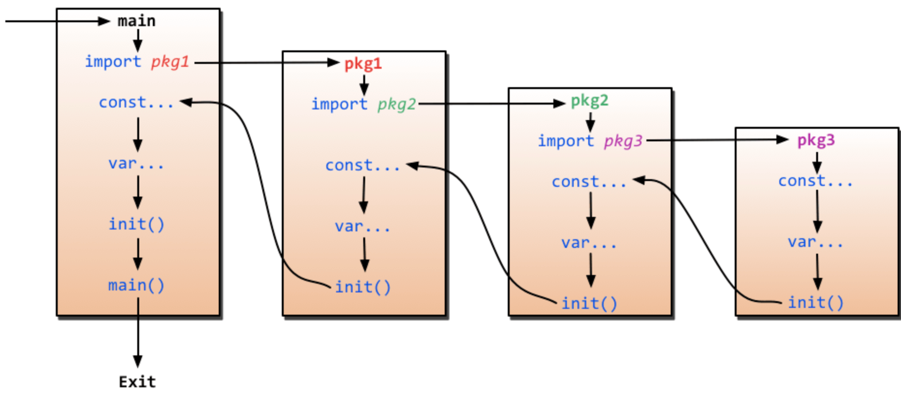
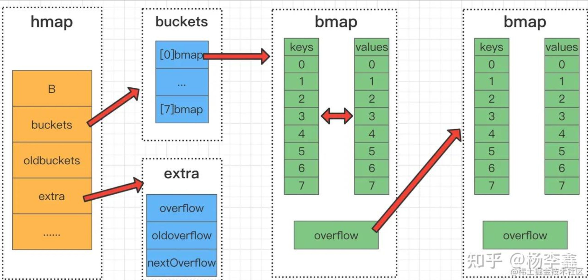

[TOC]

参考：[go语言高性能编程](https://geektutu.com/post/high-performance-go.html)(必读)


## init函数执行的时机

在main函数之前执行。

init()函数是go初始化的一部分，由runtime初始化每个导入的包，初始化不是按照从上到下的导入顺序，而是按照解析的依赖关系，没有依赖的包最先初始化。

执行顺序：import –> const –> var –>`init()`–>`main()`



1. 如果一个包导入了其他包，则首先初始化导入的包。
2. 然后初始化当前包的常量。
3. 接下来初始化当前包的变量。
4. 最后，调用当前包的 `init()` 函数。

## 方法

在调用方法的时候，值类型既可以调用`值接收者`的方法，也可以调用`指针接收者`的方法；指针类型既可以调用`指针接收者`的方法，也可以调用`值接收者`的方法。

也就是说，不管方法的接收者是什么类型，该类型的值和指针都可以调用，不必严格符合接收者的类型。

实际上，当类型和方法的接收者类型不同时，其实是编译器在背后做了一些工作，用一个表格来呈现：

| -              | 值接收者                                                     | 指针接收者                                                   |
| -------------- | ------------------------------------------------------------ | ------------------------------------------------------------ |
| 值类型调用者   | 方法会使用调用者的一个副本，类似于“传值”                     | 使用值的引用来调用方法，上例中，`qcrao.growUp()` 实际上是 `(&qcrao).growUp()` |
| 指针类型调用者 | 指针被解引用为值，上例中，`stefno.howOld()` 实际上是 `(*stefno).howOld()` | 实际上也是“传值”，方法里的操作会影响到调用者，类似于指针传参，拷贝了一份指针 |

### 值接收者和指针接收者

实现了接收者是值类型的方法，**相当于自动实现了接收者是指针类型的方法**；而实现了接收者是指针类型的方法，不会自动生成对应接收者是值类型的方法。

详细示例：https://golang.design/go-questions/interface/receiver/

如果方法的接收者是值类型，无论调用者是对象还是对象指针，修改的都是对象的副本，不影响调用者；如果方法的接收者是指针类型，则调用者修改的是指针指向的对象本身。

### 值接收者和指针接收者两者分别在何时使用 

使用指针作为方法的接收者的理由：

- 方法能够修改接收者指向的值。
- 避免在每次调用方法时复制该值，在值的类型为大型结构体时，这样做会更加高效。

是使用值接收者还是指针接收者，不是由该方法是否修改了调用者（也就是接收者）来决定，而是应该基于该类型的`本质`。

如果类型具备“原始的本质”，也就是说它的成员都是由 Go 语言里内置的原始类型，如字符串，整型值等，那就定义值接收者类型的方法。像内置的引用类型，如 slice，map，interface，channel，这些类型比较特殊，声明他们的时候，实际上是创建了一个 `header`， 对于他们也是直接定义值接收者类型的方法。这样，调用函数时，是直接 copy 了这些类型的 `header`，而 `header` 本身就是为复制设计的。

如果类型具备非原始的本质，不能被安全地复制，这种类型总是应该被共享，那就定义指针接收者的方法。比如 go 源码里的文件结构体（struct File）就不应该被复制，应该只有一份`实体`。

## 接口

`iface` 和 `eface` 都是 Go 中描述接口的底层结构体，区别在于 `iface` 描述的接口包含方法，而 `eface` 则是不包含任何方法的空接口：`interface{}`。

```go
type iface struct {
	tab  *itab						//接口的类型以及赋给这个接口的实体类型： 动态类型
	data unsafe.Pointer		// 指向接口具体的值： 动态值
}

type itab struct {
	inter  *interfacetype
	_type  *_type
	link   *itab
	hash   uint32 // copy of _type.hash. Used for type switches.
	bad    bool   // type does not implement interface
	inhash bool   // has this itab been added to hash?
	unused [2]byte
	fun    [1]uintptr // variable sized
}
```

接口值的零值是指**`动态类型`和`动态值`都为 `nil`**。当仅且当这两部分的值都为 `nil` 的情况下，这个接口值就才会被认为 `接口值 == nil`。


## 数组和切片

### 数组

数组是值类型，将一个数组赋值给另外一个数组时，会复制整个数组的值。数组长度在创建时确定，不可更改

### 切片

切片引用类型，当将一个切片赋值给另一个切片时，它们实际上引用相同的底层数组，修改值将会影响其他的切片。

切片长度：**切片的起始位置到切片的结束位置的元素数量**

切片容量：**切片的起始位置到底层数组的末尾的元素数量**

#### 切片底层

Go切片(slice)的实现可以在源码包`src/runtime/slice.go`中找到。在源码中，slice的数据结构定义如下。

```go
type slice struct {
	array unsafe.Pointer	//指向底层数组的指针
	len int					//切片长度
	cap int					//切片容量，底层数组
}
```

#### 切片拷贝

使用Copy拷贝切片时，会将源切片中的数据逐个拷贝到目的切片指向的数组中，拷贝数量取两个切片的最小值， 不会发生扩容。

#### 切片扩容

扩容操作只关心容量，会把原slice的数据拷贝至新slice中，扩容规则：

go 1.18之前：

- 原slice的容量小于1024，则新slice的容量将扩大为原来的2倍；
- 原slice的容量大于1024，则新的slice的容量将扩大为原来的1.25倍；

go 1.18更新之后：

当原slice容量(oldcap)小于256的时候，新slice(newcap)容量为原来的2倍；原slice容量超过256，新slice容量newcap = oldcap+(oldcap+3*256)/4

#### 陷阱

##### 切片扩容引发的问题

因为有扩容机制。所以无法保证**原始的slice**和用append后的**新slice**指向同一个底层数组，也无法证明它们就指向不同的底层数组。同样，我们也无法假设旧slice上对元素的操作会或者不会影响新的slice元素。所以，通常我们将append的调用结果再次赋给传入append的slice。

##### 使用range进行切片迭代 （go1.22之前的版本中）

当使用range进行切片迭代时，range创建了每个元素的副本，而不是直接返回对该元素的引用。**v值会在每次迭代时被重新赋值，且循环中每次都是使用的v变量**

并发中捕获for range变量

```go
func main() {
	done := make(chan bool)
	values := []string{"a", "b", "c"}
	for _, v := range values {
		go func() {
			fmt.Println(v)
			done <- true
		}()
	}
	// wait for all goroutines to complete before exiting
	for _ = range values {
		<-done
	}
	// 打印结果 c, c, c
}

```

在闭包中

```go
func main() {
	var prints []func()
	for i := 1; i <= 3; i++ {
		prints = append(prints, func() { fmt.Println(i) })
	}
	for _, p := range prints {
		p()
	}
	// 打印 4, 4, 4
}
```

## Map

Go 语言采用的是哈希表，并且使用链表解决哈希冲突，（即在同一个桶中使用链表来存储具有相同哈希码的键值对）

每个桶中保存了8个kv对，如果8个满了，又来了一个key落在了这个桶里，会使用overflow连接下一个桶(溢出桶)。

内存模型

```go
// A header for a Go map.
type hmap struct {
    // 元素个数，调用 len(map) 时，直接返回此值
	count     int
	flags     uint8
	// buckets 的对数 log_2
	B         uint8
	// overflow 的 bucket 近似数
	noverflow uint16
	// 计算 key 的哈希的时候会传入哈希函数
	hash0     uint32
    // 指向 buckets 数组，大小为 2^B
    // 如果元素个数为0，就为 nil
	buckets    unsafe.Pointer
	// 等量扩容的时候，buckets 长度和 oldbuckets 相等
	// 双倍扩容的时候，buckets 长度会是 oldbuckets 的两倍
	oldbuckets unsafe.Pointer
	// 指示扩容进度，小于此地址的 buckets 迁移完成
	nevacuate  uintptr
	extra *mapextra // optional fields
}
```



### map 获取数据流程

- 计算key的hash值
- 通过最后的“B”位来确定在哪号桶
- 根据key对应的hash值前8位快速确定是在这个桶的哪个位置**（额外说明一下，在bmap中存放了每个key对应的tophash，是key的哈希值前8位),一旦发现前8位一致，则会执行下一步**
- 对比key完整的hash是否匹配，如果匹配则获取对应value
- 如果都没有找到，就去连接的下一个溢出桶中找

### map的赋值流程

- 通过key的hash值后“B”位确定是哪一个桶
- 遍历当前桶，通过key的tophash和hash值，防止key重复，然后**找到第一个可以插入的位置**，即空位置处存储数据。
- 如果**当前桶元素已满，会通过overflow链接创建一个新的桶**，来存储数据。

**关于hash冲突**：当两个不同的 key 落在同一个桶中，就是发生了哈希冲突。冲突的解决手段是采用链表法：在 桶 中，从前往后找到第一个空位进行插入。如果8个kv满了，那么当前桶就会连接到下一个溢出桶（bmap）。

### 扩容

当 map 中的键值对数量达到一定阈值时，Go 语言会触发 map 的扩容操作。扩容时，Go 会创建一个新的更大的哈希表，然后将旧表中的键值对重新哈希并存储到新表中。这样做的目的是为了减小哈希冲突，提高哈希表的性能。在扩容过程中，所有读写操作仍然是安全的，因为 Go 语言会使用锁来保护这个操作。

### **无序性：** 

map 是无序的，即遍历 map 的顺序与插入键值对的顺序无关。这是因为**哈希表的索引位置**是通过**哈希码**计算得到的，不与键值对的插入顺序有直接关系。

## new和make的区别？

- `new` 用于分配内存，但不初始化该内存，返回的是指向新分配的零值内存的指针。
- make 用于**slice,map,channel**等引用类型，并进行初始化，`make` 返回的是已初始化的非零值。

## go语言的中的锁

Go 语言标准库 `sync` 提供了 2 种锁，互斥锁(sync.Mutex)和读写锁(sync.RWMutex)

### 互斥锁(sync.Mutex)

互斥不可同时运行。即使用了互斥锁的两个代码片段互相排斥，只有其中一个代码片段执行完成后，另一个才能执行。

在一个 Go 协程调用 Lock 方法获得锁后，其他请求锁的协程都会阻塞在 Lock 方法，直到锁被释放。

### 读写锁(sync.RWMutex)

`多读单写锁` (multiple readers, single writer lock)，简称读写锁，读写锁分为读锁和写锁，读锁是允许同时执行的，但写锁是互斥的。一般来说，有如下几种情况：

- 读锁之间不互斥，没有写锁的情况下，读锁是无阻塞的，多个协程可以同时获得读锁。
- 写锁之间是互斥的，存在写锁，其他写锁阻塞。
- 写锁与读锁是互斥的，如果存在读锁，写锁阻塞，如果存在写锁，读锁阻塞。

### go竞态条件了解吗？

所谓竞态竞争，就是当**两个或以上的goroutine访问相同资源时候，对资源进行读/写。**

比如`var a int = 0`，有两个协程分别对a+=1，我们发现最后a不一定为2.这就是竞态竞争。

通常我们可以用`go run -race xx.go`来进行检测。

解决方法是，对临界区资源上锁，或者使用原子操作(atomics)，原子操作的开销小于上锁

## sync.Once 的使用场景

`sync.Once` 是 Go 标准库提供的使函数只执行一次的实现，常应用于单例模式，例如初始化配置、保持数据库连接等。作用与 `init` 函数类似，但有区别。

- init 函数是当所在的 package 首次被加载时执行，若迟迟未被使用，则既浪费了内存，又延长了程序加载时间。
- sync.Once 可以在代码的任意位置初始化和调用，因此可以延迟到使用时再执行，并发场景下是线程安全的。

保证变量仅被初始化一次，需要有个标志来判断变量是否已初始化过，若没有则需要初始化。线程安全，支持并发，不需要互斥锁来实现。

## go中的GMP模型

Go里面GMP分别代表：G：goroutine，M：线程（真正在CPU上跑的），P：逻辑处理器（或调度器）。

调度器是M和G之间桥梁。在任一时刻，一个P（调度器）可能在其本地包含多个（协程）G，同时一个P在任一时刻只能绑定一个（线程）M。

go进行调度过程：

- 某个线程尝试创建一个新的G，那么这个G就会被安排到这个线程的G本地队列LRQ中，如果LRQ满了，就会分配到全局队列GRQ中；

- 尝试获取当前线程的M，如果无法获取，就会从空闲的M列表中找一个，如果空闲列表也没有，那么就创建一个M，然后绑定G与P运行。

- 进入调度循环：

- - 找到一个合适的G
  - 执行G，完成以后退出

## go内存管理机制

Go语言的内存管理机制是通过垃圾回收（Garbage Collection，GC）来实现的。下面是Go语言内存管理的基本原理：

1. **自动内存分配：** Go语言使用自动内存分配，开发者无需手动分配和释放内存。这由垃圾回收器（Garbage Collector）负责。
2. **垃圾回收（GC）：** 垃圾回收是Go语言内存管理的核心机制。Go的垃圾回收器会定期扫描程序中不再使用的内存，将其标记为可回收的垃圾，然后释放这些垃圾占用的内存。这使得开发者不必手动管理内存，大大简化了内存管理的复杂性。
3. **并发垃圾回收：** Go的垃圾回收器是并发的，它可以在程序继续执行的同时进行垃圾回收。这意味着垃圾回收不会阻塞整个程序的执行，减小了对程序性能的影响。
4. **分代回收：** Go的垃圾回收器采用分代回收策略。它将内存分为不同的代（generation），一般分为新生代和老生代。新分配的对象首先被分配到新生代，只有经过一定次数的垃圾回收后，仍然存活的对象才会被晋升到老生代。分代回收能够更有效地处理不同生命周期的对象。
5. **写屏障（Write Barrier）：** Go语言的垃圾回收器使用写屏障技术，即在进行垃圾回收时，会拦截对指针的写入操作，以便准确地追踪对象的引用关系。这有助于垃圾回收器准确地标记和回收不再被引用的对象。
6. **内存分配器：** Go语言的运行时系统包含了一个内存分配器，负责分配和释放内存。内存分配器会根据对象的大小选择合适的内存池，以提高内存分配效率。

## 通道

### channel 的常见操作

```go
// 创建 channel
ch := make(chan int) // 不带缓冲区
ch := make(chan int, 10) // 带缓冲区，缓冲区满之前，即使没有接收方，发送方不阻塞
// 关闭 channel
close(ch)

//向通道发送值 v
ch <- v

// 从通道中接收值
<-ch // 忽略接收值
v := <-ch // 接收值并赋值给变量 v
v, beforeClosed := <-ch
```

beforeClosed 代表 v 是否是信道关闭前发送的。true 代表是信道关闭前发送的，**false 代表信道已经关闭**。**如果一个信道已经关闭，`<-ch` 将永远不会发生阻塞**，但是我们可以通过第二个返回值 beforeClosed 得知信道已经关闭，作出相应的处理。

### channel 的三种状态和三种操作结果

| 操作     | 空值(nil） | 非空已关闭 | 非空未关闭       |
| :------- | :--------- | :--------- | :--------------- |
| 关闭     | panic      | panic      | 成功关闭         |
| 发送数据 | 永久阻塞   | panic      | 阻塞或成功发送   |
| 接收数据 | 永久阻塞   | 永不阻塞   | 阻塞或者成功接收 |

## 协程

### 控制协程(goroutine)的并发数量

#### 并发过高导致程序崩溃

```go
func main() {
	var wg sync.WaitGroup
	for i := 0; i < math.MaxInt32; i++ {
		wg.Add(1)
		go func(i int) {
			defer wg.Done()
			fmt.Println(i)
			time.Sleep(time.Second)
		}(i)
	}
	wg.Wait()
}
```

系统的资源会被耗尽。

如何解决？

1. 利用 channel 的缓存区

   ```go
   // main_chan.go
   func main() {
   	var wg sync.WaitGroup
   	ch := make(chan struct{}, 3)
   	for i := 0; i < 10; i++ {
   		ch <- struct{}{}
   		wg.Add(1)
   		go func(i int) {
   			defer wg.Done()
   			log.Println(i)
   			time.Sleep(time.Second)
   			<-ch
   		}(i)
   	}
   	wg.Wait()
   }
   ```

   - `make(chan struct{}, 3)` 创建缓冲区大小为 3 的 channel，在没有被接收的情况下，至多发送 3 个消息则被阻塞。
   - 开启协程前，调用 `ch <- struct{}{}`，若缓存区满，则阻塞。
   - 协程任务结束，调用 `<-ch` 释放缓冲区。
   - `sync.WaitGroup` 并不是必须的，例如 http 服务，每个请求天然是并发的，此时使用 channel 控制并发处理的任务数量，就不需要 `sync.WaitGroup`。

   这样 每秒钟只并发执行了 3 个任务，达到了协程并发控制的目的。

2. 利用第三方库

   目前有很多第三方库实现了协程池，可以很方便地用来控制协程的并发数量，比较受欢迎的有：

   - [Jeffail/tunny](https://github.com/Jeffail/tunny)
   - [panjf2000/ants](https://github.com/panjf2000/ants)


### 如何退出协程

#### 超时返回场景

```go
func doBadthing(done chan bool) {
	time.Sleep(time.Second)
	done <- true
}

func timeout(f func(chan bool)) error {
	done := make(chan bool)
	go f(done)
	select {
	case <-done:
		fmt.Println("done")
		return nil
	case <-time.After(time.Millisecond):
		return fmt.Errorf("timeout")
	}
}

func test(t *testing.T, f func(chan bool)) {
	t.Helper()
	for i := 0; i < 1000; i++ {
		timeout(f)
	}
	time.Sleep(time.Second * 2)
	t.Log(runtime.NumGoroutine()) // 打印携程数量
}

func TestBadTimeout(t *testing.T)  { test(t, doBadthing) }
```

最终程序中存在着 1002 个子协程，说明即使是函数执行完成，协程也没有正常退出，最终会导致内存耗尽（每个协程约占 2K 空间），程序崩溃。

仔细阅读这段代码可以很容易发现问题所在，`done` 是一个无缓冲区的 channel，如果没有超时，`doBadthing` 中会向 done 发送信号，`select` 中会接收 done 的信号，因此 `doBadthing` 能够正常退出，子协程也能够正常退出。

但是，当超时发生时，select 接收到 `time.After` 的超时信号就返回了，`done` 没有了接收方(receiver)，而 `doBadthing` 在执行 1s 后向 `done` 发送信号，由于没有接收者且无缓存区，发送者(sender)会一直阻塞，导致协程不能退出。

如何避免：

- 创建有缓冲区的 channel，即创建channel `done` 时，缓冲区设置为 1，即使没有接收方，发送方也不会发生阻塞。

  ```go
  func timeoutWithBuffer(f func(chan bool)) error {
  	done := make(chan bool, 1)
  	go f(done)
  	select {
  	case <-done:
  		fmt.Println("done")
  		return nil
  	case <-time.After(time.Millisecond):
  		return fmt.Errorf("timeout")
  	}
  }
  ```

- 使用 select 尝试发送

  ```go
  func doGoodthing(done chan bool) {
  	time.Sleep(time.Second)
  	select {
  	case done <- true:
  	default:
  		return
  	}
  }
  ```

因为 goroutine 不能被强制 kill，在超时或其他类似的场景下，为了 goroutine 尽可能正常退出，建议如下：

- 尽量使用非阻塞 I/O（非阻塞 I/O 常用来实现高性能的网络库），阻塞 I/O 很可能导致 goroutine 在某个调用一直等待，而无法正确结束。
- 业务逻辑总是考虑退出机制，避免死循环。
- 任务分段执行，超时后即时退出，避免 goroutine 无用的执行过多，浪费资源。

更多参考：https://geektutu.com/post/hpg-timeout-goroutine.html

#### channel 忘记关闭的陷阱

```go
func do(taskCh chan int) {
	for {
		select {
		case t := <-taskCh:
			time.Sleep(time.Millisecond)
			fmt.Printf("task %d is done\n", t)
		}
	}
}

func sendTasks() {
	taskCh := make(chan int, 10)
	go do(taskCh)
	for i := 0; i < 1000; i++ {
		taskCh <- i
	}
}

func TestDo(t *testing.T) {
    t.Log(runtime.NumGoroutine())
    sendTasks()
	time.Sleep(time.Second)
	t.Log(runtime.NumGoroutine())
}
```

- `do` 的实现非常简单，for + select 的模式，等待信道 taskCh 传递任务，并执行。
- `sendTasks` 模拟向信道中发送任务。

该用例执行结果如下：

```
$ go test . -v
--- PASS: TestDo (2.34s)
    exit_test.go:29: 2
    exit_test.go:32: 3
```

单元测试执行结束后，子协程多了一个，也就是说，有一个协程一直没有得到释放。我们仔细看代码，很容易发现 `sendTasks` 中启动了一个子协程 `go do(taskCh)`，因为这个协程一直处于阻塞状态，等待接收任务，因此直到程序结束，协程也没有释放。

解决方法：

```go
func doCheckClose(taskCh chan int) {
	for {
		select {
		case t, beforeClosed := <-taskCh:
      // 判断 channel 是否已经关闭，beforeClosed 为 false 表示信道已被关闭。若关闭，则不再阻塞等待，直接返回，对应的协程随之退出。
			if !beforeClosed {
				fmt.Println("taskCh has been closed")
				return
			}
			time.Sleep(time.Millisecond)
			fmt.Printf("task %d is done\n", t)
		}
	}
}

func sendTasksCheckClose() {
	taskCh := make(chan int, 10)
	go doCheckClose(taskCh)
	for i := 0; i < 1000; i++ {
		taskCh <- i
	}
  // sendTasks 函数中，任务发送结束之后，使用 close(taskCh) 将 channel taskCh 关闭。
	close(taskCh)
}
```

#### 通道关闭原则

一个常用的使用Go通道的原则是**不要在数据接收方或者在有多个发送者的情况下关闭通道。换句话说，我们只应该让一个通道唯一的发送者关闭此通道。**

使用 sync.Once 或互斥锁(sync.Mutex)确保 channel 只被关闭一次。

```go
type MyChannel struct {
	C    chan T
	once sync.Once
}

func NewMyChannel() *MyChannel {
	return &MyChannel{C: make(chan T)}
}

func (mc *MyChannel) SafeClose() {
	mc.once.Do(func() {
		close(mc.C)
	})
}
```

#### 优雅的方式

- 情形一：M个接收者和一个发送者，发送者通过关闭用来传输数据的通道来传递发送结束信号。
- 情形二：一个接收者和N个发送者，此唯一接收者通过关闭一个额外的信号通道来通知发送者不要再发送数据了。
- 情形三：M个接收者和N个发送者，它们中的任何协程都可以让一个中间调解协程帮忙发出停止数据传送的信号。

### 协程泄漏

Go协程泄漏是指在程序运行过程中，创建的goroutine无法正常退出并释放资源，导致这些goroutine一直存在，最终导致内存泄漏或其他资源泄漏的问题。协程泄漏可能会影响程序性能并导致不稳定的行为。以下是一些可能导致Go协程泄漏的原因以及解决方案：

#### 常见的协程泄漏原因：

协程泄漏是指协程创建之后没有得到释放

1. 缺少接收器，导致发送阻塞
2. 缺少发送器，导致接收阻塞
3. 死锁。多个协程由于竞争资源导致死锁。
4. 创建协程的没有回收。
5. **未关闭的通道：** 如果一个goroutine在等待从通道中接收数据，但通道永远不会被关闭，这个goroutine可能会一直阻塞。确保在合适的时机关闭通道，以便goroutine可以正常退出。
6. **未释放资源：** 如果在goroutine中使用了一些需要手动释放的资源（如文件句柄、数据库连接等），确保在goroutine结束时释放这些资源。
7. **循环引用：** 如果在goroutine中存在循环引用，可能导致垃圾回收器无法正确回收内存。确保在goroutine中避免循环引用。

#### 协程泄漏的排查与解决方案：

1. **使用`go vet`工具：** Go语言提供了`go vet`工具，它可以用于检查代码中的常见错误，包括协程泄漏。运行以下命令：

   ```shell
   go vet ./...
   ```

2. **使用`goroutine`分析工具：** Go语言提供了`runtime/pprof`包，可以用于分析和诊断goroutine的问题。使用`pprof`工具可以查看运行时的goroutine数量和堆栈信息。

3. **使用`defer`语句确保资源释放：** 在goroutine中使用`defer`语句，以确保在goroutine退出时执行资源释放操作。

4. **合理使用`context`：** 使用`context`包来管理goroutine的生命周期，可以方便地取消或超时goroutine，确保它们能够正常退出。

5. **使用`select`语句监听多个通道：** 如果在goroutine中使用多个通道，使用`select`语句可以避免因一个通道阻塞而导致整个goroutine泄漏。

6. **记录和分析日志：** 在关键点记录日志，特别是在goroutine启动和退出时。这有助于追踪问题并及时发现协程泄漏。


## 性能分析

### 字符串拼接

常见的拼接方式：+、fmt.Sprintf、strings.Builder、bytes.Buffer、[]byte

`strings.Builder`、`bytes.Buffer` 和 `[]byte` 的性能差距不大，而且消耗的内存也十分接近，性能最好且消耗内存小，一般**推荐使用 `strings.Builder` 来拼接字符串**。

`string.Builder` 也提供了预分配内存的方式 `Grow`：

```go
func builderConcat(n int, str string) string {
	var builder strings.Builder
	builder.Grow(n * len(str))
	for i := 0; i < n; i++ {
		builder.WriteString(str)
	}
	return builder.String()
}
```

性能背后的原理：

- +：使用+拼接2个字符串时，会新开辟一个内存空间，然后将两个字符串拷贝过去。
- fmt.Sprintf：底层使用反射，消耗性能
- strings.Builder`和bytes.Buffer 底层都是 []byte 数组，他们的内存是以倍数申请的。但 `strings.Builder` 性能比 `bytes.Buffer` 略快约 10% 。一个比较重要的区别在于，`bytes.Buffer` 转化为字符串时重新申请了一块空间，存放生成的字符串变量，而 `strings.Builder` 直接将底层的 `[]byte` 转换成了字符串类型返回了回来。

### 切片

- Delete：切片的底层是数组，因此删除意味着后面的元素需要逐个向前移位。每次删除的复杂度为 O(N)，因此**切片不合适大量随机删除的场景**，这种场景下适合使用链表。删除后，将空余的位置置空，有助于垃圾回收。

- Insert：insert 和 append 类似。即在某个位置添加一个元素后，将该位置后面的元素再 append 回去。复杂度为 O(N)。因此，不适合大量随机插入的场景。

- Filter：当原切片不会再被使用时，就地 filter 方式是比较推荐的，可以节省内存空间。

  ```go
  n := 0
  for _, x := range a {
  	if keep(x) {
  		a[n] = x
      n++
  	}
  }
  a = a[:n]
  ```

- Append：在末尾追加元素，不考虑内存拷贝的情况，复杂度为 O(1)。在头部追加元素，时间和空间复杂度均为 O(N)，不推荐。

- Pop: 尾部删除元素，复杂度 O(1)头部删除元素，如果使用切片方式，复杂度为 O(1)。但是需要注意的是，**底层数组没有发生改变，第 0 个位置的内存仍旧没有释放。如果有大量这样的操作，头部的内存会一直被占用**。

**性能陷阱**：在已有切片的基础上进行切片，不会创建新的底层数组。因为原来的底层数组没有发生变化，内存会一直占用，直到没有变量引用该数组。比较推荐的做法，使用 `copy` 替代 `re-slice`。

```go
func lastNumsBySlice(origin []int) []int {
	return origin[len(origin)-2:]
}

func lastNumsByCopy(origin []int) []int {
	result := make([]int, 2)
	copy(result, origin[len(origin)-2:])
	return result
}
```

### for循环

range 在迭代过程中返回的是**迭代值的拷贝**，如果每次迭代的元素的内存占用很低，那么 for 和 range 的性能几乎是一样，例如 `[]int`。但是**如果迭代的元素内存占用较高**，例如一个包含很多属性的 struct 结构体，**那么 for 的性能将显著地高于 range**，有时候甚至会有上千倍的性能差异。对于这种场景，建议使用 for，如果使用 range，建议只迭代下标，通过下标访问迭代值，这种使用方式和 for 就没有区别了。**如果想使用 range 同时迭代下标和值，则需要将切片/数组的元素改为指针**，才能不影响性能。


### 传值 VS 传指针

传值会拷贝整个对象，而传指针只会拷贝指针地址，指向的对象是同一个。传指针可以减少值的拷贝，但是会导致**内存分配逃逸到堆中**，**增加垃圾回收(GC)的负担**。在对象频繁创建和删除的场景下，传递指针导致的 GC 开销可能会严重影响性能。

一般情况下，**对于需要修改原对象值，或占用内存比较大的结构体，选择传指针。对于只读的占用内存较小的结构体，直接传值能够获得更好的性能**。

### 空结构体节省内存空间

在 Go 语言中，我们可以使用 `unsafe.Sizeof` 计算出一个数据类型实例需要占用的字节数。

```go
func main() {
	fmt.Println(unsafe.Sizeof(struct{}{}))
}
```

也就是说，空结构体 struct{} 实例不占据任何的内存空间，因此被广泛作为占位符使用。比如：

- 实现集合(Set)，go语言中没有实现集合（Set），将 map 作为集合(Set)使用时，可以将值类型定义为空结构体，仅作为占位符使用即可。
- 不发送数据的信道(channel)，有时候使用 channel 不需要发送任何的数据，只用来通知子协程(goroutine)执行任务，或只用来控制协程并发度。这种情况下，使用空结构体作为占位符就非常合适了。
- 仅有方法的结构体

### 内存对齐

CPU 访问内存时，并不是逐个字节访问，而是以字长（word size）为单位访问。比如 32 位的 CPU ，字长为 4 字节，那么 CPU 访问内存的单位也是 4 字节。

这么设计的目的，是减少 CPU 访问内存的次数，加大 CPU 访问内存的吞吐量。比如同样读取 8 个字节的数据，一次读取 4 个字节那么只需要读取 2 次。


## 缓存

缓存的类型分为：**本地缓存**、**分布式缓存**和**多级缓存**。

### 本地缓存

**本地缓存**是内存访问，没有远程交互开销，性能最好，但是受限于单机容量，一般缓存较小且无法扩展。

### 分布式缓存：

分布式缓存一般都具有良好的水平扩展能力，对较大数据量的场景也能应付自如。缺点就是需要进行远程请求，性能不如本地缓存。

### 多级缓存：

为了平衡这种情况，实际业务中一般采用**多级缓存**，本地缓存只保存访问频率最高的部分热点数据，其他的热点数据放在分布式缓存中。

在目前的一线大厂中，这也是最常用的缓存方案，单考单一的缓存方案往往难以撑住很多高并发的场景。

## redis

参考链接：https://zhuanlan.zhihu.com/p/91539644

Redis（Remote Dictionary Server）是一种开源的内存数据库，通常被用作缓存、消息队列、实时分析（例如计数器和统计数据）以及会话存储。

### **Redis 是什么？它的特点是什么？**

- Redis 是一个开源的内存数据库，它支持多种数据结构，包括字符串、列表、集合、有序集合、哈希表等。
- 特点包括单线程、异步iO、高性能、持久化、支持数据复制、支持多种数据结构、原子性操作等。

### 使用场景

1. **缓存**: Redis 最常见的用途是作为缓存存储。由于它将数据存储在内存中，因此访问速度非常快。通过将常用的查询结果或计算结果存储在 Redis 中，可以减轻数据库的负担，提高应用程序的响应速度。
2. **会话存储**: Redis 可以用作分布式会话存储，特别是在负载均衡的环境中。将用户会话数据存储在 Redis 中，可以确保用户在多个服务器之间的无缝切换而无需重新登录。
3. **消息队列**: Redis 支持发布/订阅模式，使其成为一个强大的消息队列系统。应用程序可以使用 Redis 的发布/订阅功能实现异步通信，解耦不同组件之间的操作。
4. **实时计数器和统计数据**: Redis 提供了一些原子操作，使其非常适合用作计数器。这可用于实时跟踪网站访问次数、用户在线状态等。在统计数据方面，Redis 的有序集合（Sorted Sets）可以用来存储和查询排名信息。
5. **地理空间索引**: Redis 6.0 引入了地理空间索引功能，允许存储和查询地理位置信息。这使得 Redis 可以用于构建位置服务和地理信息系统。
6. **分布式锁**: 在分布式系统中，使用 Redis 可以实现分布式锁，确保多个进程或服务不会同时修改共享资源，从而避免竞态条件。
7. **实时消息推送**: 利用 Redis 的发布/订阅功能，可以实现实时消息推送。这对于构建即时聊天应用或实时通知系统非常有用。
8. **任务队列**: 将任务放入 Redis 队列，然后由工作者进程异步处理这些任务。这在处理后台任务、定时任务等方面非常有用。

总体而言，Redis 是一个多功能的数据存储系统，它在内存中操作数据，提供了高性能和灵活性，使其成为许多不同场景下的理想选择。


## Mysql

索引、锁机制

事务特性、隔离级别


### 优化数据库的方法

- 选取最适用的字段属性，尽可能减少定义字段宽度，尽量把字段设置NOTNULL，例如’省份’、’性别’最好适用ENUM
- 使用连接(JOIN)来代替子查询
- 适用联合(UNION)来代替手动创建的临时表
- 事务处理
- 锁定表、优化事务处理
- 适用外键，优化锁定表
- 建立索引
- 优化查询语句

### 说说对SQL语句优化有哪些方法？（选择几条）

1. Where子句中：where表之间的连接必须写在其他Where条件之前，那些可以过滤掉最大数量记录的条件必须写在Where子句的末尾.HAVING最后。
2. 用EXISTS替代IN、用NOT EXISTS替代NOT IN。
3. 避免在索引列上使用计算
4. 避免在索引列上使用IS NULL和IS NOT NULL
5. 对查询进行优化，应尽量避免全表扫描，首先应考虑在 where 及 order by 涉及的列上建立索引。
6. 应尽量避免在 where 子句中对字段进行 null 值判断，否则将导致引擎放弃使用索引而进行全表扫描
7. 应尽量避免在 where 子句中对字段进行表达式操作，这将导致引擎放弃使用索引而进行全表扫描

## 微服务
