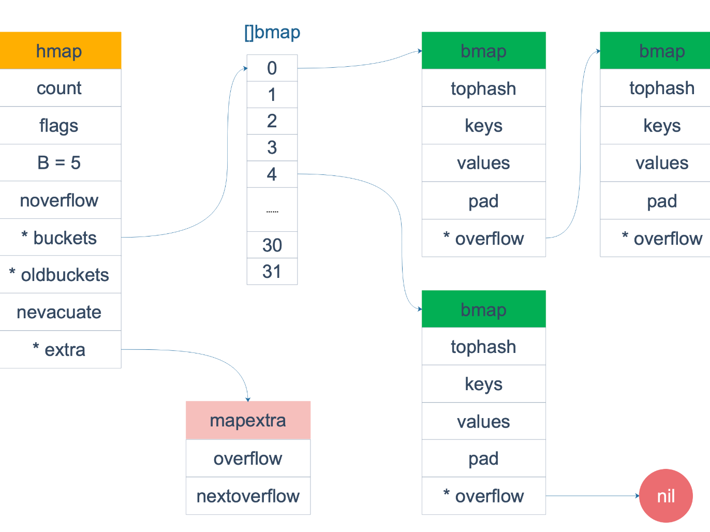

参考链接：

- https://golang.design/go-questions/map/principal/
- https://zhuanlan.zhihu.com/p/495998623

## map 的底层如何实现 

Go 语言采用的是哈希表，并且使用链表解决哈希冲突，即在同一个桶中使用链表来存储具有相同哈希码的键值对

map内存模，在`src/runtime/map.go`中

```go
// A header for a Go map.
type hmap struct {
    // 元素个数，调用 len(map) 时，直接返回此值
	count     int
	flags     uint8
	// buckets 的对数 log_2，buckets 数组的长度的对数
	B         uint8
	// overflow 的 bucket 近似数
	noverflow uint16
	// 计算 key 的哈希的时候会传入哈希函数
	hash0     uint32
    // 指向 buckets 数组，大小为 2^B
    // 如果元素个数为0，就为 nil
	buckets    unsafe.Pointer
	// 等量扩容的时候，buckets 长度和 oldbuckets 相等
	// 双倍扩容的时候，buckets 长度会是 oldbuckets 的两倍
	oldbuckets unsafe.Pointer
	// 指示扩容进度，小于此地址的 buckets 迁移完成
	nevacuate  uintptr
	extra *mapextra // optional fields
}
```

buckets 是一个指针，最终它指向的是一个结构体：

```go
type bmap struct {
	tophash [bucketCnt]uint8
}
```

但这只是表面(src/runtime/hashmap.go)的结构，编译期间会动态地创建一个新的结构：

```go
type bmap struct {
    topbits  [8]uint8
    keys     [8]keytype
    values   [8]valuetype
    pad      uintptr
    overflow uintptr
}
```

`bmap` 就是我们常说的“桶”，桶里面会最多装 8 个 key，这些 key 之所以会落入同一个桶，是因为它们经过哈希计算后，哈希结果是“一类”的。在桶内，又会根据 key 计算出来的 hash 值的高 8 位来决定 key 到底落入桶内的哪个位置（一个桶内最多有8个位置）。

每个 bucket 设计成最多只能放 8 个 key-value 对，如果有第 9 个 key-value 落入当前的 bucket，那就需要再构建一个 bucket ，通过 `overflow` 指针连接起来。




Go 语言中的函数传参都是值传递，在函数内部，参数会被 copy 到本地。`*hmap`指针 copy 完之后，仍然指向同一个 map，因此在函数内部修改map会影响到原map


### 扩容

当 map 中的键值对数量达到一定阈值时，Go 语言会触发 map 的扩容操作。扩容时，Go 会创建一个新的更大的哈希表，然后将旧表中的键值对重新哈希并存储到新表中。这样做的目的是为了减小哈希冲突，提高哈希表的性能。在扩容过程中，所有读写操作仍然是安全的，因为 Go 语言会使用锁来保护这个操作。

### **无序性：** 

map 是无序的，即遍历 map 的顺序与插入键值对的顺序无关。这是因为**哈希表的索引位置**是通过**哈希码**计算得到的，不与键值对的插入顺序有直接关系。

