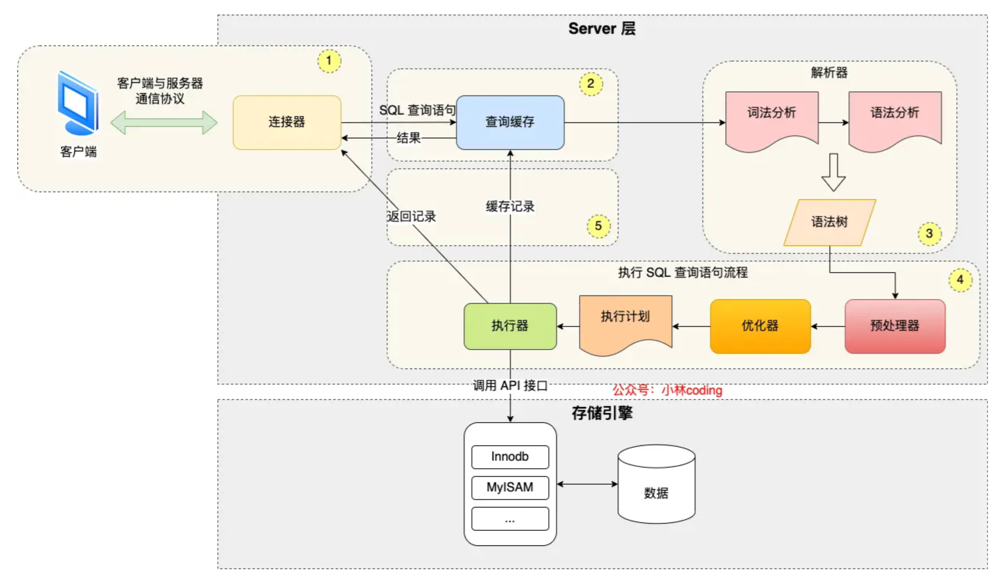

[TOC]

## Mysql

### varchar 与 char 的区别？

**char**：

- char 表示定长字符串，长度是固定的；
- 如果插入数据的长度小于 char 的固定长度时，则用空格填充；
- 因为长度固定，所以存取速度要比 varchar 快很多，甚至能快 50%，但正因为其长度固定，所以会占据多余的空间，是空间换时间的做法；
- 对于 char 来说，最多能存放的字符个数为 255，和编码无关。

**varchar**：

- varchar 表示可变长字符串，长度是可变的；
- 插入的数据是多长，就按照多长来存储；
- varchar 在存取方面与 char 相反，它存取慢，因为长度不固定，但正因如此，不占据多余的空间，是时间换空间的做法；
- 对于 varchar 来说，最多能存放的字符个数为 65532

日常的设计，对于长度相对固定的字符串，可以使用 char，对于长度不确定的，使用 varchar 更合适一些。

### DATETIME 和 TIMESTAMP 的区别

1. **日期范围**：DATETIME 的日期范围是 `1000-01-01 00:00:00.000000` 到 `9999-12-31 23:59:59.999999`；TIMESTAMP 的时间范围是`1970-01-01 00:00:01.000000` UTC `到 ``2038-01-09 03:14:07.999999` UTC
2. **存储空间**：DATETIME 的存储空间为 8 字节；TIMESTAMP 的存储空间为 4 字节
3. **时区相关**：DATETIME 存储时间与时区无关；TIMESTAMP 存储时间与时区有关，显示的值也依赖于时区
4. **默认值**：DATETIME 的默认值为 null；TIMESTAMP 的字段默认不为空(not null)，默认值为当前时间(CURRENT_TIMESTAMP)

###  一条 SQL 查询语句的执行顺序？

查询语句执行顺序

1. **FROM**：对 FROM 子句中的左表<left_table>和右表<right_table>执行笛卡儿积（Cartesianproduct），产生虚拟表 VT1
2. **ON**：对虚拟表 VT1 应用 ON 筛选，只有那些符合<join_condition>的行才被插入虚拟表 VT2 中
3. **JOIN**：如果指定了 OUTER JOIN（如 LEFT OUTER JOIN、RIGHT OUTER JOIN），那么保留表中未匹配的行作为外部行添加到虚拟表 VT2 中，产生虚拟表 VT3。如果 FROM 子句包含两个以上表，则对上一个连接生成的结果表 VT3 和下一个表重复执行步骤 1）～步骤 3），直到处理完所有的表为止
4. **WHERE**：对虚拟表 VT3 应用 WHERE 过滤条件，只有符合<where_condition>的记录才被插入虚拟表 VT4 中
5. **GROUP BY**：根据 GROUP BY 子句中的列，对 VT4 中的记录进行分组操作，产生 VT5
6. **CUBE|ROLLUP**：对表 VT5 进行 CUBE 或 ROLLUP 操作，产生表 VT6
7. **HAVING**：对虚拟表 VT6 应用 HAVING 过滤器，只有符合<having_condition>的记录才被插入虚拟表 VT7 中。
8. **SELECT**：第二次执行 SELECT 操作，选择指定的列，插入到虚拟表 VT8 中
9. **DISTINCT**：去除重复数据，产生虚拟表 VT9
10. **ORDER BY**：将虚拟表 VT9 中的记录按照<order_by_list>进行排序操作，产生虚拟表 VT10。11）
11. **LIMIT**：取出指定行的记录，产生虚拟表 VT11，并返回给查询用户

### MySQL 的基础架构



- **客户端**：最上层的服务并不是 MySQL 所独有的，大多数基于网络的客户端/服务器的工具或者服务都有类似的架构。比如连接处理、授权认证、安全等等。
- **Server 层**：连接器、查询缓存、解析器、优化器、执行器等在这一层。
- **存储引擎层**：存储引擎负责 MySQL 中数据的存储和提取。Server 层通过 API 与存储引擎进行通信。这些接口屏蔽了不同存储引擎之间的差异，使得这些差异对上层的查询过程透明。

### mysql储存引擎

- **InnoDB**：  默认储存引擎，支持事务、回滚、行级锁、外键约束、自动增量列（AUTO_INCREMENT）等特性
- **MyISAM**：
  - 提供全文本搜索功能，适合用于一些搜索引擎和日志分析。
  - 非事务型存储引擎、使用表级锁，可能导致高并发情况下的性能问题。
  -  MyISAM 支持表级别的压缩，可以减小磁盘占用，使用表级锁，不适合高并发写入的场景。
- **MEMORY**：
  - MEMORY 存储引擎创建的**表被存储在内存中**，适合于需要快速访问的临时表
  - 使用表级锁，不适合高并发写入的场景。
  - 在数据库重新启动或崩溃时，数据将会丢失。
  -  由于数据存储在内存中，读写速度非常快。

### 执行一条 SQL 查询语句，期间发生了什么？

- 连接器：建立连接，管理连接、校验用户身份；
- 查询缓存：查询语句如果命中查询缓存则直接返回，否则继续往下执行。**MySQL 8.0 已删除该模块**；
- 解析 SQL，通过解析器对 SQL 查询语句进行词法分析、语法分析，然后构建语法树，方便后续模块读取表名、字段、语句类型；
- 执行 SQL：执行 SQL 共有三个阶段：
  - 预处理阶段：检查表或字段是否存在；将 `select *` 中的 `*` 符号扩展为表上的所有列。
  - 优化阶段：基于查询成本的考虑， 选择查询成本最小的执行计划；
  - 执行阶段：根据执行计划执行 SQL 查询语句，从存储引擎读取记录，返回给客户端；

### 索引

索引的定义就是帮助存储引擎快速获取数据的一种数据结构，可以说**索引是数据的目录**。

#### 索引分类

- 按「字段特性」分类：**主键索引、唯一索引、普通索引、前缀索引**。
- 按「字段个数」分类：**单列索引、联合索引**。
- 按「物理存储」分类：**聚簇索引（主键索引）、二级索引（辅助索引）**。
- 按「数据结构」分类：**B+tree索引、Hash索引、Full-text索引**。

#### 主键索引和二级索引的区别：

- 主键索引的 B+Tree 的叶子节点存放的是实际数据，所有完整的用户记录都存放在主键索引的 B+Tree 的叶子节点里；
- 二级索引的 B+Tree 的叶子节点存放的是主键值，而不是实际数据。

在查询时使用了二级索引，如果查询的数据能在二级索引里查询的到，那么就不需要回表，这个过程就是覆盖索引。如果查询的数据不在二级索引里，就会先检索二级索引，找到对应的叶子节点，获取到主键值后，然后再检索主键索引，就能查询到数据了，这个过程就是**回表**。

#### 什么时候需要 / 不需要创建索引？

索引最大的好处是提高查询速度，但是索引也是有缺点的，比如：

- 需要占用物理空间，数量越大，占用空间越大；
- 创建索引和维护索引要耗费时间，这种时间随着数据量的增加而增大；
- 会降低表的**增删改**的效率，因为每次增删改索引，B+ 树为了维护索引有序性，都需要**进行动态维护**。

##### 什么时候需要索引？

- **字段有唯一性限制的**，比如商品编码；
- **经常用于 `WHERE` 查询条件的字段**，这样能够提高整个表的查询速度，如果查询条件不是一个字段，可以建立联合索引。
- **经常用于 `GROUP BY` 和 `ORDER BY` 的字段**，这样在查询的时候就不需要再去做一次排序了，因为建立索引之后在 B+Tree 中的记录都是排序好的。

##### 什么时候不需要创建索引？

- `WHERE` 条件，`GROUP BY`，`ORDER BY` 里用不到的字段，索引的价值是快速定位，如果起不到定位的字段通常是不需要创建索引的，因为索引是会占用物理空间的。
- 字段中存在大量重复数据，不需要创建索引，比如性别字段，只有男女，如果数据库表中，男女的记录分布均匀，那么无论搜索哪个值都可能得到一半的数据。在这些情况下，还不如不要索引，因为 MySQL 还有一个查询优化器，查询优化器发现某个值出现在表的数据行中的百分比很高的时候，它一般会忽略索引，进行全表扫描。
- 表数据太少的时候，不需要创建索引；
- 经常更新的字段不用创建索引，比如不要对电商项目的用户余额建立索引，因为索引字段频繁修改，由于要维护 B+Tree的有序性，那么就需要频繁的重建索引，这个过程是会影响数据库性能的。

### 索引失效的情况

- **使用左或者左右模糊匹配**的时候，也就是 `like %xx` 或者 `like %xx%`这两种方式都会造成索引失效；
- **在查询条件中对索引列做了计算、函数、类型转换操作**，这些情况下都会造成索引失效；
- **联合索引要能正确使用需要遵循最左匹配原则**，也就是按照最左优先的方式进行索引的匹配，否则就会导致索引失效。
- **在 WHERE 子句中，如果在 OR 前的条件列是索引列，而在 OR 后的条件列不是索引列**，那么索引会失效。

### 事务

#### 事务有哪些特性？

事务是由 MySQL 的引擎来实现的，我们常见的 InnoDB 引擎它是支持事务的。

(ACID) **4 个特性**：

- **原子性（Atomicity）**：一个事务中的所有操作，要么全部完成，要么全部不完成。
- **一致性（Consistency）**：是指事务操作前和操作后，数据满足完整性约束，数据库保持一致性状态。
- **隔离性（Isolation）**：多个事务可以并发执行，但每个事务的执行应该与其他事务隔离开来，互不干扰。隔离性确保一个事务的执行不会影响其他事务正在执行的过程，防止数据不一致性。
- **持久性（Durable）**：一旦事务成功提交，其对数据库的修改就是永久性的，即使系统发生故障或重启，事务对数据库的影响也会被保留。

InnoDB 引擎通过什么技术来保证事务的这四个特性的呢？

- 持久性是通过 redo log （重做日志）来保证的；
- 原子性是通过 undo log（回滚日志） 来保证的；
- 隔离性是通过 MVCC（多版本并发控制） 或锁机制来保证的；
- 一致性则是通过持久性+原子性+隔离性来保证；

### 事务的隔离级别

**四种隔离级别：**

- **读未提交（\*read uncommitted\*）**，指一个事务还没提交时，它做的变更就能被其他事务看到；**可能发生脏读、不可重复读和幻读现象**
- **读提交（\*read committed\*）**，指一个事务提交之后，它做的变更才能被其他事务看到；**可能发生不可重复读和幻读现象**。
- **可重复读（\*repeatable read\*）**，指一个事务执行过程中看到的数据，一直跟这个事务启动时看到的数据是一致的，**可能发生幻读现象**，**MySQL InnoDB 引擎的默认隔离级别**；
- **串行化（\*serializable\* ）**；会对记录加上读写锁，在多个事务对这条记录进行读写操作时，如果发生了读写冲突的时候，后访问的事务必须等前一个事务执行完成，才能继续执行；

当多个**事务并发执行时可能会遇到「脏读、不可重复读、幻读」的现象**，这些现象会对事务的一致性产生不同程序的影响。

- **脏读**：读到其他事务未提交的数据；
- **不可重复读**：前后读取的数据不一致；
- **幻读**：前后读取的记录数量不一致。

这三个现象的严重性排序：胀读 > 不可重复读 > 幻读

[MySQL InnoDB 引擎的默认隔离级别虽然是「可重复读」，但是它很大程度上避免幻读现象（并不是完全解决了

解决的方案有两种：

- 针对**快照读**（普通 select 语句），是**通过多版本并发控制 MVCC 方式解决了幻读**，因为可重复读隔离级别下，**事务执行过程中看到的数据，跟这个事务启动时看到的数据是一致的**，即使中途有其他事务插入了一条数据，是查询不出来这条数据的，所以就很好了避免幻读问题。
- 针对**当前读**（select ... for update 等语句），是**通过 next-key lock（记录锁+间隙锁）方式解决了幻读**，因为当执行 select ... for update 语句的时候，会加上 next-key lock，如果有其他事务在 next-key lock 锁范围内插入了一条记录，那么这个插入语句就会被阻塞，无法成功插入，所以就很好了避免幻读问题。

**并发事务问题的解决方案**

**数据丢失**

可以基于数据库中的「悲观锁」来避免，在查询时通过在事务中使用 select xx for update 语句来实现排他锁，保证在该事务结束之前其他事务无法更新该数据。

也可以基于「乐观锁」来避免，将某一字段作为版本号，如果更新时的版本号跟之前的版本一致，则更新，否则更新失败。

### Mysql 锁

在 MySQL 里，根据加锁的范围，可以分为**全局锁、表级锁和行锁**三类。

#### 全局锁

全局锁主要应用于做**全库逻辑备份**，这样在备份数据库期间，不会因为数据或表结构的更新，而出现备份文件的数据与预期的不一样。

要使用全局锁：`flush tables with read lock`

执行后，**整个数据库就处于只读状态了**，这时其他线程执行以下操作，都会被阻塞：

- 对**数据的增删改**操作，比如 insert、delete、update等语句；
- 对**表结构的更改**操作，比如 alter table、drop table 等语句。

释放全局锁：`unlock tables`，当会话断开了，全局锁会被自动释放。

如果数据库支持**可重复读的的隔离级别**，**那么在备份数据库之前先开启事物，备份期间业务依然可以对数据进行更新操作。**

因为在可重复读的隔离级别下，即使其他事务更新了表的数据，也不会影响备份数据库时的 Read View，这就是事务四大特性中的隔离性，这样备份期间备份的数据一直是在开启事务时的数据。

#### 表级锁

不过尽量避免在使用 InnoDB 引擎的表使用表锁，因为表锁的颗粒度太大，会影响并发性能，**InnoDB 牛逼的地方在于实现了颗粒度更细的行级锁**。

#### 行级锁

InnoDB 引擎是支持行级锁的，而 MyISAM 引擎并不支持行级锁。

普通的 select 语句是不会对记录加锁的，因为它属于快照读。如果要在查询时对记录加行锁，可以使用两个方式：

```
//对读取的记录加共享锁
select ... lock in share mode;
//对读取的记录加独占锁
select ... for update;
```

共享锁（S锁）满足读读共享，读写互斥。独占锁（X锁）满足写写互斥、读写互斥。

#### 如何避免死锁？

死锁的四个必要条件：**互斥、占有且等待、不可强占用、循环等待**。只要系统发生死锁，这些条件必然成立，但是只要破坏任意一个条件就死锁就不会成立。

在数据库层面，有两种策略通过「打破循环等待条件」来解除死锁状态：

- **设置事务等待锁的超时时间**。当一个事务的等待时间超过该值后，就对这个事务进行回滚，于是锁就释放了，另一个事务就可以继续执行了。在 InnoDB 中，参数 `innodb_lock_wait_timeout` 是用来设置超时时间的，默认值时 50 秒。
- **分布式锁**代替数据库实现幂等性校验。

- **开启主动死锁检测**。主动死锁检测在发现死锁后，主动回滚死锁链条中的某一个事务，让其他事务得以继续执行。将参数 `innodb_deadlock_detect` 设置为 on，表示开启这个逻辑，默认就开启。

我们可以回归业务的角度来预防死锁，对订单做幂等性校验的目的是为了保证不会出现重复的订单，那我们可以直接将 order_no 字段设置为唯一索引列，利用它的唯一性来保证订单表不会出现重复的订单，不过有一点不好的地方就是在我们插入一个已经存在的订单记录时就会抛出异常。

### MySQL 大表优化

### 索引优化

这里说一下几种常见优化索引的方法：

- **前缀索引优化**：使用某个字段中字符串的前几个字符建立索引，前缀索引有一定的局限性：order by 就无法使用前缀索引，无法把前缀索引用作覆盖索引；

- **覆盖索引优化**：指 SQL 中 query 的所有字段，在索引 B+Tree 的叶子节点上都能找得到的那些索引，**从二级索引中查询得到记录，而不需要通过主键索引查询获得，可以避免回表的操作**。

  比如说将商品的id、条形码建立一个组合索引，避免回表操作。

- **自增主键**：InnoDB 创建主键索引默认为聚簇（主键）索引，数据被存放在了 B+Tree 的叶子节点上。也就是说，**同一个叶子节点内的各个数据是按主键顺序存放的，因此，每当有一条新的数据插入时，数据库会根据主键将其插入到对应的叶子节点中。**

- **索引最好设置为 NOT NULL**：

  - 索引列存在 NULL 就会导致优化器在做索引选择的时候更加复杂，更加难以优化，因为可为 NULL 的列会使索引、索引统计和值比较都更复杂，比如进行索引统计时，count 会省略值为NULL 的行。
  - NULL 值是一个没意义的值，但是它会占用物理空间，所以会带来的存储空间的问题，因为 InnoDB 存储记录的时候，如果表中存在允许为 NULL 的字段，那么[行格式 (opens new window)](https://xiaolincoding.com/mysql/base/row_format.html#innodb-行格式有哪些)中**至少会用 1 字节空间存储 NULL 值列表**，如下图的紫色部分：

- **防止索引失效，发生索引失效的情况**：

  - **使用左或者左右模糊匹配**的时候，也就是 `like %xx` 或者 `like %xx%`这两种方式都会造成索引失效；
  - **在查询条件中对索引列做了计算、函数、类型转换操作**，这些情况下都会造成索引失效；
  - **联合索引要能正确使用需要遵循最左匹配原则**，也就是按照最左优先的方式进行索引的匹配，否则就会导致索引失效。
  - **在 WHERE 子句中，如果在 OR 前的条件列是索引列，而在 OR 后的条件列不是索引列**，那么索引会失效。

  