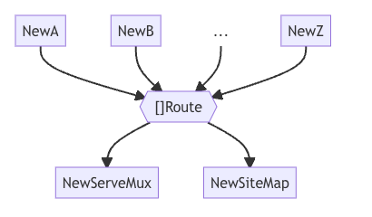

[TOC]


github地址：https://github.com/uber-go/fx

官方文档：https://uber-go.github.io/fx/get-started/

解析 Golang 依赖注入经典解决方案 uber/fx 理论篇：https://juejin.cn/post/7153582825399124005

解析 Golang 依赖注入经典解决方案 uber/fx 实战篇：https://juejin.cn/post/7153992019193856031

## GetStarted

一步一步通过fx示例来了解其基本用法

参考官方文档：https://uber-go.github.io/fx/get-started/

## 介绍 introduction

`Fx` 是 Go 语言的一个依赖注入系统。它提供了一种简化应用程序设置、消除全局状态、并能够立即在整个应用程序中访问新组件的方法。通过 `Fx`，你可以：

1. **减少样板代码**：`Fx` 可以帮助你减少设置应用程序时的重复代码，使得代码更加简洁易读。
2. **消除全局状态**：传统上，全局状态可能导致代码难以维护和测试。`Fx` 提倡依赖注入的方式，通过将依赖项传递给需要它们的组件，而不是依赖于全局状态。
3. **快速访问新组件**：添加新组件后，它们可以立即在整个应用程序中访问，而无需进行复杂的配置或手动管理。
4. **构建通用可分享的模块**：`Fx` 的设计使得构建通用的、可分享的模块变得更加容易，这些模块可以轻松地被应用于不同的项目中。

总的来说，`Fx` 旨在简化 Go 应用程序的开发过程，通过依赖注入和模块化的方式提高代码的可维护性、可测试性和可扩展性。

## 功能 features

### 参数对象 Parameters Object

参数对象是一个专门用于携带特定函数或方法参数的对象。

这个对象通常专门为某个函数而定义，并且不与其他函数共享。换句话说，参数对象不像“用户（user）”这样是通用的对象，而是为特定用途而构建的，比如“获取用户函数（GetUser function）”所需的参数。

在 `Fx` 中，参数对象包含的字段必须是公开（exported）的，并且始终使用 `fx.In` 进行标记。

这种方法的优势在于它使得**函数签名更清晰**，将一组相关的参数封装到一个对象中**，提高了代码的可读性和可维护性**。此外，它还允许在**不破坏函数签名的情况下轻松地添加或删除参数**，因为所有参数都封装在一个对象中。

举个例子，假设有一个获取用户信息的函数 `GetUser`：

```go
type GetUserParams struct {
    UserID string
    // 其他 GetUser 函数需要的参数字段...
}

func GetUser(params GetUserParams) (User, error) {
    // 根据参数获取用户信息的逻辑...
}
```

#### 使用参数对象

定义规则，一般构造器名为`NewClient` 那么参数对象结构体为`ClientParams`，命名没有严格要求，但是这是一个很好的习惯

```go
type ClientParams struct {
	fx.In
  
  // 定义公开字段
  Config ClientConfig
  HTTPClient *http.Client
}
```

在构造器中使用这些字段

```go
fun NewClient(p ClientParams) (*Client, error) {
	retrun &Client{
		url: p.Config.URL,
		http: p.HTTPClient,
		// ...
	}, nil
}
```

#### 添加新的参数对象

您可以通过向参数对象添加新字段来为构造函数添加新参数。 为了向后兼容，新字段必须是可选的。

```go
type Params struct {
  fx.In

  Config     ClientConfig
  HTTPClient *http.Client
  Logger *zap.Logger `optional:"true"` // 添加新的参数，为来向后兼容，这里设置为可选
}
 
```

在您的构造函数中，使用该字段。 请务必处理该字段不存在的情况——在这种情况下，它将采用其类型的零值。

```go
func New(p Params) (*Client, error) {
  log := p.Logger
  if log == nil {
    log = zap.NewNop()
  }
  // ...

```

### 结果对象 Result Objects

与参数对象类似，结果对象也是专门为单个函数而定义的，不与其他函数共享。

在 `Fx` 中，结果对象包含的字段必须是公开（exported）的，并且始终使用 `fx.Out` 进行标记。

这种模式的优势在于它使得函数返回值更加清晰，将函数的多个返回值封装到一个对象中，提高了代码的可读性和可维护性。同样，与参数对象类似，这也允许在**不改变函数签名**的情况下轻松地添加或删除返回值。

举个例子，假设有一个函数 `ProcessData`，它返回两个值，可以使用结果对象来封装这两个返回值：

```go
type ProcessDataResult struct {
    ResultValue string
    ErrorCode   int
    // 其他 ProcessData 函数返回的字段...
}

func ProcessData() (ProcessDataResult, error) {
    // 处理数据的逻辑...
    result := ProcessDataResult{
        ResultValue: "Processed result",
        ErrorCode:   0,
    }
    return result, nil
}

```

#### 使用结果对象

当你有一个名为 `NewClient` 的构造函数时，相应的结果结构体应该命名为 `ClientResult`。同样地，如果构造函数名为 `New`，那么结构体应该命名为 `Result`。

```go
type ClientResult struct {
  fx.Out

  Client *Client // 包含公开字段
}

```

设置这些字段，并返回一个实例

```go
func NewClient() (ClientResult, error) {
  client := &Client{
    // ...
  }
  return ClientResult{Client: client}, nil
}

```

一旦函数有了结果对象，您就可以使用它来访问 Fx 的其他高级功能：

- [Feeding value groups with result objects](https://uber-go.github.io/fx/value-groups/feed.html#with-result-objects)

#### 添加新的结果

您可以以完全向后兼容的方式向现有结果对象添加新值。

```go
type Result struct {
  fx.Out

  Client *Client
  Inspector *Inspector // 添加新的字段

}

func New() (Result, error) {
  client := &Client{
    // ...
  }
  return Result{
    Client: client,
    Inspector: &Inspector{
      // ...
    },
  }, nil
 

```

### 注解

在 `Fx` 中，你可以使用 `fx.Annotate` 函数来给函数和值（`values`）添加注解（Annotations），然后将它们传递给 `fx.Provide`、`fx.Supply`、`fx.Invoke`、`fx.Decorate` 或 `fx.Replace` 函数。

这样做可以使你在不手动包装函数以使用参数或结果对象的情况下，实现以下目的：

1. **向值组（Value Group）提供值**（`values`）[feed values to a value group](https://uber-go.github.io/fx/value-groups/feed.html#with-annotated-functions)
2. **从值组（Value Group）使用值**(`values`) [consume values from a value group](https://uber-go.github.io/fx/value-groups/consume.html#with-annotated-functions)

这意味着你可以利用 `fx.Annotate` 在不修改现有函数签名的情况下，将函数和值与 `Fx` 的依赖注入系统集成起来。这种方式使得重用现有的函数变得更加简单，同时也增加了代码的可组合性和可维护性。

#### 注解函数

前提条件 **Prerequisites**

一个函数：

- 使用 `fx.ParamTags` 进行注解时，不接受参数对象。
- 使用 `fx.ResultTags` 进行注解，时不返回结果对象。

**Steps**

1. 给定一个要传递给 fx.Provide、fx.Invoke 或 fx.Decorate 的函数，

   ```go
   fx.Provide(
     NewHTTPClient,
   )
   ```

2. 使用 `fx.Annotate` 对函数进行包装：

   ```go
   fx.Provide(
     fx.Annotate(
       NewHTTPClient,
     ),
   )
   
   ```

3. 在`fx.Annotate`中添加注解

   ```go
   fx.Provide(
     fx.Annotate(
       NewHTTPClient,
       fx.ResultTags(`name:"client"`), // 为函数返回值添加了标记 name:"client"。
     ),
   )
   
   ```

在这个场景中，注释 `name:"client"` 被添加到了 `NewHTTPClient` 函数的结果上。这允许在 `Fx` 依赖注入框架中使用附加的元数据来描述这个函数结果。

- [fx.Annotation ](https://pkg.go.dev/go.uber.org/fx#Annotation) 包含了所有支持注解的列表

#### 将结构体转换为接口

您可以使用函数注释将函数返回的结构体值转换为另一个函数使用的接口。

1. 假设有一个生成结构体或指针值的函数：

   ```go
   func NewHTTPClient(config Config) (*http.Client, error) {
       // 生成 http.Client 的逻辑...
   }
   
   ```

2. 还有一个消费该生成结果的函数：

   ```go
   func NewGitHubClient(client *http.Client) *github.Client {
       // 使用 http.Client 来创建 github.Client 的逻辑...
   }
   ```

3. 两个函数都被提供给了 Fx 应用程序：

   ```go
   fx.Provide(
     NewHTTPClient,
     NewGitHubClient,
   )
   
   ```

将`Client`抽象为接口：

1. 声明一个与生成的`*http.Client API` 匹配的接口

   ```go
   type HTTPClient interface {
     Do(*http.Request) (*http.Response, error)
   }
   
   // 这是一个在编译时验证我们的接口与 http.Client API 匹配的声明。
   var _ HTTPClient = (*http.Client)(nil)
   
   ```

2. 将使用者修改为接收接口而不是结构体

   ```go
   func NewGitHubClient(client HTTPClient) *github.Client {
       // 使用 HTTPClient 接口来创建 github.Client 的逻辑...
   }
   
   ```

3. 最后，在生成的函数上添加`fx.As`注解，声明其生成接口值：

   ```go
   fx.Provide(
     fx.Annotate(
     	NewHTTPClient,
       fx.As(new(HTTPClient))
     ),
     NewGitHubClient,
   )
   ```

通过这些改变：

- 被注释的函数现在只将接口放入容器中。
- 生成函数的 API 保持不变。
- 使用者与具体实现解耦，可以独立测试。

这样的变化使得你可以在 Fx 应用程序中更灵活地使用接口，而不是直接操作具体的结构体。

### 值组（value group)

值组是**相同类型的值的集合**。 Fx 应用程序中任意数量的构造函数都可以将值输入到值组中。 同样，任意数量的消费者都可以从值组中读取数据，而无需了解完整的生产者列表。



**注意：**Fx 不保证数值组中值的顺序，所以在处理数值组时，不应该依赖于它们的特定顺序。如果你的应用程序逻辑需要值按特定顺序进行处理，最好在代码中显式地进行排序或管理。

#### 注入值组（Feeding value groups）

当你想要将值传递给 Fx 中的一个类型为 `T` 的数值组（value group）时，你需要将类型为 `T` 的结果标记为 `group:"$name"`，其中 `$name` 是数值组的名称。

有两种方法可以实现这一点：

##### 使用结果对象 With result objects

在使用结果对象（result objects）来标记函数结果并将其传递到值组时，你需要完成以下步骤：

前提条件：

一个产生结果对象的函数：

```go
type Result struct {
  fx.Out

  // ...
  Watcher Watcher // 一个字段用于标记并传递到数值组中
}

func New( /* ... */ ) (Result, error) {
  // ...
  watcher := &watcher{
    // ...
  }

  return Result{
    // ...
    Watcher: watcher,
  }, nil
}
```

将函数提供给`Fx`

```go
// 将函数提供给 Fx 应用程序
fx.Provide(New)

```

**Steps:**

1. 在结果对象中添加一个新的可导出字段，并标记它为想要传递到值组（`value group`）中的值类型

   ```go
   type Result struct {
     fx.Out
   
     // ...
     Watcher Watcher `group:"watchers"` // 标记为要传递到数值组的字段
   }
   ```

2. 在函数中，设置这个新的字段为你想要传递到值组中的值

   ```go
   func New( /* ... */ ) (Result, error) {
     // ...
     watcher := &watcher{
       // ...
     }
   
     return Result{
       // ...
       Watcher: watcher, // 将数值分配给标记字段
     }, nil
   }
   ```

通过这些步骤，你可以使用结果对象将特定字段标记为要传递到数值组中的数值。这使得 Fx 能够将这些数值自动地组织到相应的数值组中，以便后续在应用程序中使用。

##### 使用注解函数 With annotated functions

可以使用注解函数来将现有函数的结果传递到一个值组中

假设你有一个生成值并符合值组要求的函数：

```go
func NewWatcher( /* ... */ ) (Watcher, error) {
  // ...
}

// 将该函数提供给 Fx 应用程序
fx.Provide(
  NewWatcher,
)
```

**Steps**

1. 将提供给 `fx.Provide` 的函数使用 `fx.Annotate` 进行包装：

   ```go
   fx.Provide(
     fx.Annotate(
       NewWatcher,
     ),
   )
   
   ```

2. 在注释函数时，使用 `fx.ResultTags` 声明其结果将被提供给数值组：

   ```go
   fx.Annotate(
     NewWatcher,
     fx.ResultTags(`group:"watchers"`),
   )
   
   ```

**提示：**

如果你要注解的函数生成的类型与值组的类型不完全匹配，但可以被转换成相同的类型：

```go
func NewFileWatcher( /* ... */ ) (*FileWatcher, error) {

  // 你仍然可以使用注释将其提供给数值组
fx.Annotate(
  NewFileWatcher,
  fx.As(new(Watcher)),
  fx.ResultTags(`group:"watchers"`),
)
```

即使类型不完全匹配，你也可以使用注解来提供函数结果给数值组。这种方法允许你在不需要完全匹配类型的情况下将结果提供给数值组。

#### 使用（消费）值组

当你想要消费类型为 `T` 的数值组（value group）时，在 Fx 中，你需要使用 `group:"$name"` 标记一个 `[]T` 类型的依赖，其中 `$name` 是数值组的名称。

可以通过以下两种方式来实现：

- 使用参数对象（Parameter Objects）
- 使用注解函数 （Annotated Fnctions）

##### 使用参数对象

在使用参数对象（Parameter Objects）时，你可以将函数的切片参数标记为一个数值组（value group）。

前提条件：

一个消费参数对象的函数

```go
type Params struct {
  fx.In

  // ...
  Watchers []Watcher // 一个标记为数值组的字段
}

func New(p Params) (Result, error) {
  // ...
  for _, w := range p.Watchers {
    // 使用 p.Watchers 中的数值组进行操作...
  }
}

```

将函数提供给fx

```go
fx.Provide(New)
```

**步骤：**

1. 在参数对象中添加一个新的导出字段，并将其类型设为 `[]T`，其中 `T` 是数值组中数值的类型。用数值组的名称来标记该字段。

   ```go
   type Params struct {
     fx.In
   
     // ...
     Watchers []Watcher `group:"watchers"` // 标记为数值组的字段
   }
   
   ```

2. 在消费该参数对象的函数中使用这个切片。

   ```go
   func New(p Params) (Result, error) {
     // ...
     for _, w := range p.Watchers {
       // 使用 p.Watchers 中的数值组进行操作...
     }
   }
   
   ```

**注意事项：**

不要依赖切片中数值的顺序。数值的顺序是随机的。

这些步骤允许你在函数中使用参数对象来消费数值组。将切片字段标记为数值组后，Fx 将会自动注入该数值组，供函数使用。但请注意，数值组中数值的顺序是随机的，所以在处理数值组时，不要依赖于它们的特定顺序。

##### 使用注解函数

你可以通过使用注解函数来消费现有函数的数值组。

假设你有一个接受数值组类型切片并操作该切片的函数：

```go
func NewEmitter(watchers []Watcher) (*Emitter, error) {
  // 使用 watchers 数值组进行操作...
}
```

将提供给 `fx.Provide` 的函数使用 `fx.Annotate` 进行包装：

```go
fx.Provide(
  fx.Annotate(
    NewEmitter,
  ),
)

```

在注释函数时，使用 `fx.ParamTags` 声明其参数是数值组：

```go
fx.Annotate(
  NewEmitter,
  fx.ParamTags(`group:"watchers"`),
)
```

在函数中使用该切片进行操作：

```go
func NewEmitter(watchers []Watcher) (*Emitter, error) {
  for _, w := range watchers {
    // 对 watchers 数值组进行操作...
  }
}

```

**提示：函数可以接受可变参数**

你也可以让函数接受可变参数来消费数值组，而不是直接接受切片。

```go
func EmitterFrom(watchers ...Watcher) (*Emitter, error) {
  return &Emitter{ws: watchers}, nil
}

```

使用 `fx.Annotate` 对可变参数进行标记，就像它是一个切片一样：

```go
fx.Annotate(
  EmitterFrom,
  fx.ParamTags(`group:"watchers"`),
)

```

这些步骤让你可以使用带有注释的函数来消费数值组。通过将数值组参数标记为特定的数值组名称，Fx 可以自动注入数值组，供函数使用。同时，你也可以选择将数值组作为可变参数来消费。


