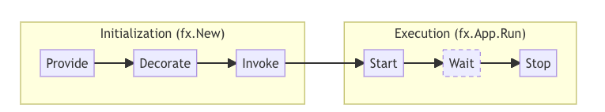

## 应用声明周期 lifecycle

在 Fx 应用程序的生命周期中，有两个主要阶段：初始化（Initialization）和执行（Execution）。每个阶段都包含多个步骤。

### 初始化阶段：

在初始化阶段，Fx 执行以下操作：

- 注册通过 `fx.Provide` 提供的所有构造函数（constructors）。
- 注册通过 `fx.Decorate` 提供的所有装饰函数（decorators）。
- 执行所有传递给 `fx.Invoke` 的函数，根据需要调用构造函数和装饰函数。

### 执行阶段：

在执行阶段，Fx 执行以下操作：

- 执行由提供程序（providers）、装饰函数（decorators）和调用函数添加到应用程序的所有启动钩子（startup hooks）。
- 等待一个停止运行的信号（可以是指定的信号或条件）。
- 执行附加到应用程序的所有关闭钩子（shutdown hooks）。

这种清晰的初始化和执行阶段的分离使得 Fx 能够管理应用程序的设置、运行和优雅关闭。初始化阶段涉及设置依赖项，而执行阶段涉及运行应用程序并根据特定的信号或条件管理其生命周期。

## Lifecycle hooks

Fx 中的生命周期钩子提供了在应用程序启动或关闭时执行工作的能力。Fx 提供了两种类型的钩子：

### 启动钩子（OnStart 钩子）：

这些钩子按照它们被附加的顺序依次执行。它们是在应用程序启动期间计划执行的任务或函数。

### 关闭钩子（OnStop 钩子）：

这些钩子以它们被附加的相反顺序执行。它们是在应用程序关闭期间计划执行的任务或函数。

通常，提供启动钩子的组件也会提供相应的关闭钩子。这使它们能够在启动时释放它们获取的任何资源。

Fx 对这两种类型的钩子都执行了严格的超时检查。因此，钩子预期只会阻塞所需的时间来安排工作。换句话说：

- 钩子不应阻塞同步执行长时间的任务。
- 相反，钩子应该在后台 goroutine 中安排任何长时间运行的任务。
- 关闭钩子应停止启动钩子启动的任何后台工作，以确保干净的关闭。

通过遵循这些准则，Fx 确保应用程序的启动和关闭过程得到有效管理，而不会出现不必要的延迟或阻塞操作。