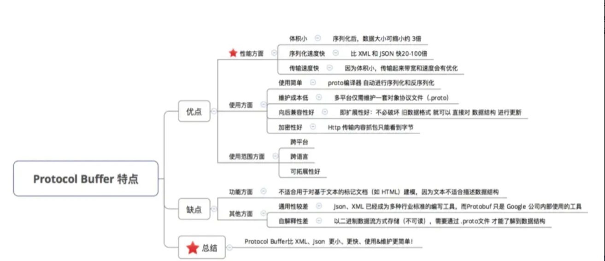

一个企业应用通常会包含多个内部服务，内部服务之间也存在调用关系。因为是内部服务调用，我们更关注接口的性能，至于接口的规范化、语言无关性、易懂性相比于性能来说，优先级可以放低。RPC 接口的性能要比 REST 接口性能高，企业服务内部通信通常会使用 RPC 协议。

当前 Go 语言最受欢迎的 RPC 实现是 [gRPC](https://link.juejin.cn/?target=https%3A%2F%2Fgithub.com%2Fgrpc%2Fgrpc-go)。腾讯、阿里、百度等许多大型互联网公司，内部都大量使用了 gRPC 来进行 RPC 通信。

一个企业应用服务之间的调用模型通常如下图所示：


所以，除了要会实现 HTTP/HTTPS 服务器之外，你还要学会如何实现一个 gRPC 服务器。为了给你展示如何开发一个 gRPC 服务器，miniblog 也实现了一个 gRPC 服务器。

## gRPC 核心知识讲解

关于 gRPC，当前最好的学习资料就是官网文档：[gRPC 官网文档](https://link.juejin.cn/?target=https%3A%2F%2Fgrpc.io%2Fdocs%2F)。gRPC 库的 Go 语言实现是：[grpc/grpc-go](https://link.juejin.cn/?target=https%3A%2F%2Fgithub.com%2Fgrpc%2Fgrpc-go)。你可以通过以下 3 个方面来学习 gRPC：

- RPC 协议原理；
- gRPC 协议原理；
- Protocol Buffers 语法。

### RPC 介绍

gRPC 是 RPC 的 Go 语言实现，所以我们有必要先了解下 RPC 协议。

根据维基百科的定义，RPC（Remote Procedure Call），即远程过程调用，是一个计算机通信协议。该协议允许运行于一台计算机的程序调用另一台计算机的子程序，而程序员不用额外地为这个交互作用编程。

通俗来讲，就是服务端实现了一个函数，客户端使用 RPC 框架提供的接口，像调用本地函数一样调用这个函数，并获取返回值。RPC 屏蔽了底层的网络通信细节，使得开发人员无需关注网络编程的细节，可以将更多的时间和精力放在业务逻辑本身的实现上，从而提高开发效率。

RPC 的调用过程如下图所示：


RPC 调用具体流程如下：

1. Client 通过本地调用，调用 Client Stub；
2. Client Stub 将参数打包（也叫 Marshalling）成一个消息，然后发送这个消息；
3. Client 所在的 OS 将消息发送给 Server；
4. Server 端接收到消息后，将消息传递给 Server Stub；
5. Server Stub 将消息解包（也叫 Unmarshalling）得到参数；
6. Server Stub 调用服务端的子程序（函数），处理完后，将最终结果按照相反的步骤返回给 Client。

目前，业界有很多优秀的 RPC 协议，例如腾讯的 Tars、阿里的 Dubbo、微博的 Motan、Facebook 的 Thrift、RPCX 等。但使用最多的还是 [gRPC](https://link.juejin.cn/?target=https%3A%2F%2Fgithub.com%2Fgrpc%2Fgrpc-go)。

> 提示：Stub 是存根（代理的意思）。

### gRPC 介绍

gRPC 是由 Google 开发的高性能、开源、跨多种编程语言的通用 RPC 框架，基于 HTTP 2.0 协议开发，默认采用 Protocol Buffers 数据序列化协议。gRPC 具有如下特性：

- 语言中立：支持多种语言，例如 Go、Java、C、C++、C#、Node.js、PHP、Python、Ruby 等；
- 基于 IDL 定义服务：基于 IDL（Interface Definition Language）文件定义服务，通过 proto3 工具生成指定语言的数据结构、服务端接口以及客户端 Stub。通过这种方式，也可以将服务端和客户端解耦，使客户端和服务端可以并行开发；
- 基于 HTTP/2 协议：通信协议基于标准的 HTTP/2 设计，支持双向流、消息头压缩、单 TCP 的多路复用、服务端推送等特性；
- 支持 Protocol Buffer 序列化：Protocol Buffer 简称 Protobuf，是一种语言无关的高性能序列化框架，可以减少网络传输流量，提高通信效率。另外，Protobuf 语法简单，表达能力强很适合用来进行接口定义。

> 
> 提示：gRPC 的全称不是 golang Remote Procedure Call，而是 google Remote Procedure Call。

gRPC 的调用如下图（图片来自官方文档）所示：


上图中的调用流程如下：

1. 客户端（gRPC Sub）调用 A 方法，发起 RPC 调用；
2. 对请求信息使用 Protobuf 进行对象序列化压缩（IDL）；
3. 服务端（gRPC Server）接收到请求后，解码请求体，进行业务逻辑处理并返回；
4. 对响应结果使用 Protobuf 进行对象序列化压缩（IDL）；
5. 客户端接收到服务端响应，解码请求体。回调被调用的 A 方法，唤醒正在等待响应（阻塞）的客户端调用并返回响应结果。

像很多其他的 RPC 服务一样，gRPC 也是通过 IDL 语言，预先定义好接口（接口的名字、传入参数和返回参数等）。在服务端，gRPC 服务实现我们所定义的接口。在客户端，gRPC 存根提供了跟服务端相同的方法。

gRPC API 接口通常使用的数据传输格式是 Protocol Buffers。接下来，我们就一起了解下 Protocol Buffers。

### Protocol Buffers 介绍

Protocol Buffers（ProtocolBuffer/ protobuf）是 Google 开发的一套对数据结构进行序列化的方法，可用作（数据）通信协议、数据存储格式等，也是一种更加灵活、高效的数据格式，与 XML、JSON 类似。它的传输性能非常好，所以常被用在一些对数据传输性能要求比较高的系统中，作为数据传输格式。Protocol Buffers 的主要特性有下面这几个。

- 更快的数据传输速度：protobuf 在传输时，会将数据序列化为二进制数据，和 XML、JSON 的文本传输格式相比，这可以节省大量的 IO 操作，从而提高数据传输速度。
- 跨平台多语言：protobuf 自带的编译工具 protoc 可以基于 protobuf 定义文件，编译出不同语言的客户端或者服务端，供程序直接调用，因此可以满足多语言需求的场景。
- 具有非常好的扩展性和兼容性，可以更新已有的数据结构，而不破坏和影响原有的程序。
- 基于 IDL 文件定义服务，通过 proto3 工具生成指定语言的数据结构、服务端和客户端接口。

在 gRPC 的框架中，Protocol Buffers 主要有三个作用。

**第一，可以用来定义数据结构。** 举个例子，下面的代码定义了一个 `UserInfo` 数据结构：

```protobuf
message UserInfo {
  string username = 1;
  string nickname = 2;
  string email = 4;
  string phone = 5;
  int64 postCount = 6;
  google.protobuf.Timestamp createdAt = 7;
  google.protobuf.Timestamp updatedAt = 8;
}

```

**第二，可以用来定义服务接口。** 下面的代码定义了一个 `MiniBlog` 服务：

```protobuf
service MiniBlog {
  rpc ListUser(ListUserRequest) returns (ListUserResponse) {}
}

```

**第三，可以通过 protobuf 序列化和反序列化，提升传输效率。**

我们知道使用 XML、JSON 进行数据编译时，数据文本格式更容易阅读，但进行数据交换时，设备就需要耗费大量的 CPU 在 I/O 动作上，自然会影响整个传输速率。Protocol Buffers 不像前者，它会将字符串进行序列化后再进行传输，即二进制数据。


可以看到其实两者内容相差不大，并且内容非常直观，但是 Protocol Buffers 编码的内容只是提供给操作者阅读的，实际上传输的内容并不会以这种文本形式，而是序列化后的二进制数据。字节数会比 JSON、XML 的字节数少很多，速率更快。

在目前或者说未来信息数据爆炸的时代，因为 Protocol Buffers 是以二进制的形式进行传输的，传输效率相比 XML、JSON 有天然的优势，而数据采集效率必然是架构设计、运维建设考虑的重点之一。

这里有一张图（网图）也总结了 Protocol Buffer 的特点，供你参考：



## 如何学习 gRPC？

gRPC 目前没有太多的文档可供你选择，当前最好的文档就是 [gRPC 官方文档](https://link.juejin.cn/?target=https%3A%2F%2Fgrpc.io%2Fdocs%2Fwhat-is-grpc%2F)，为了方便你学习，这里我整理下面这些文档，你可以参考学习：

- gRPC 基础介绍可参考：[Introduction to gRPC](https://link.juejin.cn/?target=https%3A%2F%2Fgrpc.io%2Fdocs%2Fwhat-is-grpc%2Fintroduction%2F)；
- gRPC 快速学习代码示例，可参考：[Quick start](https://link.juejin.cn/?target=https%3A%2F%2Fgrpc.io%2Fdocs%2Flanguages%2Fgo%2Fquickstart%2F)；
- gRPC 服务完整创建流程可参考：[Basics tutorial](https://link.juejin.cn/?target=https%3A%2F%2Fgrpc.io%2Fdocs%2Flanguages%2Fgo%2Fbasics%2F)；
- Protobuf 语法课参考：[Language Guide (proto3)](https://link.juejin.cn/?target=https%3A%2F%2Fdevelopers.google.com%2Fprotocol-buffers%2Fdocs%2Fproto3)；
- 如何由 protobuf 文件生成 Go 代码可参考：[Go Generated Code](https://link.juejin.cn/?target=https%3A%2F%2Fdevelopers.google.com%2Fprotocol-buffers%2Fdocs%2Freference%2Fgo-generated)；
- gRPC 更多示例代码可参考：[examples](https://link.juejin.cn/?target=https%3A%2F%2Fgithub.com%2Fgrpc%2Fgrpc-go%2Ftree%2Fmaster%2Fexamples)；
- gRPC 实现原理建议直接学习源码：[grpc/grpc-go](https://link.juejin.cn/?target=https%3A%2F%2Fgithub.com%2Fgrpc%2Fgrpc-go)。

你学习完以上文档之后，就可以去开发一个大型的 gRPC 服务了。miniblog gRPC 实现就是参考了 Basics tutorial（miniblog 的很多代码都不是从 0 写的，而是借鉴了其他优秀的实现）。

建议在学习下面的内容前，你提前根据官方的 [Quick start](https://link.juejin.cn/?target=https%3A%2F%2Fgrpc.io%2Fdocs%2Flanguages%2Fgo%2Fquickstart%2F) 跑通一遍 gRPC 服务的创建和使用流程，利于你理解下面的内容。

## miniblog 实现 gRPC 服务器

为了展示如何实现一个 gRPC 服务器，并展示如何通信，miniblog 模拟了一个场景：miniblog 配套一个运营系统，运营系统需要通过接口获取所有的用户，进行注册用户统计。为了确保应用的最优化，这种内部调用我选择了通过 RPC 协议来调用。为此，miniblog 需要实现一个 gRPC 服务器。那么如何实现一个 gRPC 服务器呢？其实很简单，可以通过以下 3 步来实现：

1. 定义 gRPC 服务；
2. 生成客户端和服务器代码；
3. 实现 gRPC 服务端；
4. 实现 gRPC 客户端。

另外，grpc-go 官方仓库也有很多代码实现，可供你参考：[examples](https://link.juejin.cn/?target=https%3A%2F%2Fgithub.com%2Fgrpc%2Fgrpc-go%2Ftree%2Fmaster%2Fexamples)。这里有一个 [Basics tutorial](https://link.juejin.cn/?target=https%3A%2F%2Fgrpc.io%2Fdocs%2Flanguages%2Fgo%2Fbasics%2F) 你也可以阅读学习。miniblog gRPC 实现就是参考了 Basics tutorial（miniblog 的很多代码都不是从 0 写的，而是借鉴了其他优秀的实现）。

建议在学习下面的内容前，你提前根据官方的 [Quick start](https://link.juejin.cn/?target=https%3A%2F%2Fgrpc.io%2Fdocs%2Flanguages%2Fgo%2Fquickstart%2F) 跑通一遍 gRPC 服务的创建和使用流程，利于你理解下面的内容。

### 定义 gRPC 服务

我们需要编写 `.proto` Protobuf 定义文件来定义一个 gRPC 服务。服务包含以下内容：

1. 服务定义：定义了服务包含了哪些 API 接口；
2. 定义请求和返回参数：服务定义了一系列的 API 接口，每个 API 接口需要一些请求参数和返回参数来完成请求。

新建 `pkg/proto/miniblog/v1/miniblog.proto` 文件，内容如下：

```ini
syntax = "proto3"; // 告诉编译器此文件使用什么版本的语法

package v1;

import "google/protobuf/timestamp.proto";

option go_package = "github.com/nosbelm/miniblog/pkg/proto/miniblog/v1";

// MiniBlog 定义了一个 MiniBlog RPC 服务.
service MiniBlog {
  rpc ListUser(ListUserRequest) returns (ListUserResponse) {}
}

message UserInfo {
  string username = 1;         
  string nickname = 2;         
  string email = 4;         
  string phone = 5;         
  int64 postCount = 6;         
  google.protobuf.Timestamp createdAt = 7;         
  google.protobuf.Timestamp updatedAt = 8;         
}

// ListUserRequest 指定了 `ListUser` 接口的请求参数.
message ListUserRequest {
  optional int64 limit = 1;
  optional int64 offset = 2;
}


// ListUserResponse 指定了 `GET /v1/users` 接口的返回参数，相当于 HTTP Response.
message ListUserResponse {
  int64 totalCount = 1;         
  repeated UserInfo Users = 2;
}
```

因为 gRPC 接口需要提供给外部用户进行调用，调用依赖 gRPC API 接口的请求参数和返回参数，所以我将 `miniblog.proto` 文件存放在 `pkg/proto/miniblog/v1/` 目录下。路径中有一个 `v1` ，说明这是 `v1` 版本的接口定义，方便以后版本升级。

接下来，我会分 3 部分，来解读以上 Protobuf 文件中的语法。

**第 1 部分：文件头定义。**

`miniblog.proto` 是一个 Protobuf 文件，首个非空、非注释的行必须注明 Protobuf 的版本，通过 `syntax = "proto3"` 来指定，当前使用的版本号是 `proto3`。

`option` 关键字用来对 `.proto` 文件进行一些设置，其中 `go_package` 是必需的设置，而且 `go_package` 的值必须是包导入的路径。`package` 关键字指定生成的 `.pb.go` 文件所在的包名。

**第 2 部分：服务定义。**

我们通过 `service` 关键字，定义了一个 `MiniBlog` 服务。在 `MiniBlog` 服务中，我们通过 `rpc` 关键字，定义了服务的 API 接口。接口中包含了请求参数 `ListUserRequest` 和返回参数 `ListUserResponse`。你可以将 miniblog 所有需要实现的 RPC 接口都定义在 `MiniBlog` 服务定义中。

gRPC 支持定义 4 种类型的服务方法，上述我们其实定义的是简单模式的服务方法。4 种服务方法介绍如下：

- 简单模式（Simple RPC）：是最简单的 gRPC 模式。客户端发起一次请求，服务端响应一个数据。定义格式为 `rpc SayHello (HelloRequest) returns (HelloReply) {}`；
- 服务端数据流模式（Server-side streaming RPC）：客户端发送一个请求，服务器返回数据流响应，客户端从流中读取数据直到为空。定义格式为 `rpc SayHello (HelloRequest) returns (stream HelloReply) {}`；
- 客户端数据流模式（Client-side streaming RPC）：客户端将消息以流的方式发送给服务器，服务器全部处理完成之后返回一次响应。定义格式为 `rpc SayHello (stream HelloRequest) returns (HelloReply) {}`；
- 双向数据流模式（Bidirectional streaming RPC）：客户端和服务端都可以向对方发送数据流，这个时候双方的数据可以同时互相发送，也就是可以实现实时交互 RPC 框架原理。定义格式为 `rpc SayHello (stream HelloRequest) returns (stream HelloReply) {}`。

**第 3 部分：接口参数定义。**

可以使用 `message` 关键字来定义消息类型（接口参数）。消息类型中包含多个字段，每一个字段都由 `类型`、`名称组成`，位于 `=` 右边的值不是字段默认值，而是数字标签，可以理解为字段身份的标识符，类似于数据库中的主键，不可重复。标识符用于在编译后的二进制消息格式中，对字段进行识别，一旦你的 protobuf 消息投入使用，字段的标识就不应该再改变。数字标签的范围是 `[1, 536870911]`，其中 `19000～19999` 是保留数字。

在定义消息的时候，还可以使用 `singular`、`optional`、`repeated` 3 个关键字来修饰字段：

- `singular`：默认值，说明该字段可以出现 0 次或者 1 次（不能超过 1 次）；
- `optional`：指定字段为可选字段；
- `repeated`：指定字段可以重复任意次数（包括 0），可以看成是一个数组。

在项目开发中，最常用的是 `optional`、`repeated`。

在使用 Go 语言开发 gRPC 服务时，常用的消息定义方法及编译后的效果如下：

消息定义：

```ini
message ModifierExample {                                                                                      
  reserved 2, 15 to 25;
  string username = 1;                                                                     
  optional string nickname = 3;                                            
  bool hasEmail = 4;                                                   
  repeated string phones = 5;   
  bytes content = 6;                                                 
  int32 money  = 7;                                                  
  int64 count = 8;                                                   
  map<string, int64> address = 9;  
  google.protobuf.Timestamp createdAt = 10;                                              
}
```

编译后：

```c
type ModifierExample struct {
    state         protoimpl.MessageState
    sizeCache     protoimpl.SizeCache
    unknownFields protoimpl.UnknownFields

    Username  string                 `protobuf:"bytes,1,opt,name=username,proto3" json:"username,omitempty"`
    Nickname  *string                `protobuf:"bytes,3,opt,name=nickname,proto3,oneof" json:"nickname,omitempty"`
    HasEmail  bool                   `protobuf:"varint,4,opt,name=hasEmail,proto3" json:"hasEmail,omitempty"`
    Phones    []string               `protobuf:"bytes,5,rep,name=phones,proto3" json:"phones,omitempty"`
    Content   []byte                 `protobuf:"bytes,6,opt,name=content,proto3" json:"content,omitempty"`
    Money     int32                  `protobuf:"varint,7,opt,name=money,proto3" json:"money,omitempty"`
    Count     int64                  `protobuf:"varint,8,opt,name=count,proto3" json:"count,omitempty"`
    Address   map[string]int64       `protobuf:"bytes,9,rep,name=address,proto3" json:"address,omitempty" protobuf_key:"bytes,1,opt,name=key,proto3" protobuf_val:"varint,2,opt,name=value,proto3"`
    CreatedAt *timestamppb.Timestamp `protobuf:"bytes,10,opt,name=createdAt,proto3" json:"createdAt,omitempty"`
}
```

更多 Protobuf 语法请参考：[Language Guide (proto3)](https://link.juejin.cn/?target=https%3A%2F%2Fdevelopers.google.com%2Fprotocol-buffers%2Fdocs%2Fproto3)。

### 生成客户端和服务器代码

编写好 Protobuf 文件后，需要使用 `protoc` 工具编译该文件，以生成我们需要的客户端和服务端代码。因为，随着项目的迭代，我们经常需要修改 Protobuf 文件，并重新编译。为了提高开发效率、简化项目维护复杂度，我们可以将编译操作作为一个Makefile目标来执行。在 `Makefile` 文件中添加以下代码：

```ini

# Protobuf 文件存放路径
APIROOT=$(ROOT_DIR)/pkg/proto
...

protoc: ## 编译 protobuf 文件.
  @echo "===========> Generate protobuf files"
  @protoc                                            \
    --proto_path=$(APIROOT)                          \
    --proto_path=$(ROOT_DIR)/third_party             \
    --go_out=paths=source_relative:$(APIROOT)        \
    --go-grpc_out=paths=source_relative:$(APIROOT)   \
    $(shell find $(APIROOT) -name *.proto)
```

`protoc`是通过插件机制实现对不同语言的支持。比如 `--xxx_out` 参数，那么 `protoc` 将首先查询是否有内置的 `xxx` 插件，如果没有内置的 `xxx` 插件，那么将继续查询当前系统中是否存在 `protoc-gen-xxx` 命名的可执行程序。例如 `--go_out` 使用的插件名为 `protoc-gen-go`。

`protoc` 命令参数说明：

- `-proto_path` 或者 `-I` 参数用以指定所编译源码（包括直接编译的和被导入的 proto 文件）的搜索路径；
- `--go_out`：参数之间用逗号隔开（例如：`--go_out=plugins=grpc,paths=import:.`），主要的参数有 `plugins` 和 `paths`，分别表示生成 Go 代码所使用的插件，以及生成的 Go 代码的位置。这里我们使用到了 `paths` 参数，它有 2 个选项：
  - `import`：默认值，代表按照生成的 Go 代码的包的全路径去创建目录层级；
  - `source_relative`：代表按照 `.proto` 源文件的目录层级去创建 Go 代码的目录层级，如果目录已存在，则不用创建。
- `--go-grpc_out`：跟 `--go_out` 类似，只是该参数指定的是 `*_grpc.pb.go` 文件的存放路径。

在 `pkg/proto/miniblog/v1/miniblog.proto` 文件中，我们通过以下语句导入了 `google/protobuf/timestamp.proto` 文件：

```arduino
import "google/protobuf/timestamp.proto";
```

所以，我们要将 `timestamp.proto` 文件保存在匹配的路径下，并且通过 `--proto_path=$(ROOT_DIR)/third_party` 添加到 proto 文件的搜索路径中（需要注意目录层级）。

因为 `timestamp.proto` 是第三方项目的文件，根据目录结构规范，我们需要存放在项目根目录下的 `third_party` 目录中。

最后，执行以下命令编译 Protobuf 文件：

```go
$ make protoc
```

上述命令会在 `pkg/proto/miniblog/v1/` 目录下生成以下 2 个文件：

- `miniblog.pb.go`：根据 `message` 关键字所指定的消息结构体，生成对应的 Go 结构体和方法的保存文件；
- `miniblog_grpc.pb.go`：根据 `service` 关键字所指定的 gRPC 服务定义，生成对应的 interface 和方法的保存文件。

> 提示：因为编译 protobuf 文件，并不是每次构建都需要执行的操作，所以我没有将 `protoc` 目标加入 Makefile `all` 目标的依赖中。

### 实现服务端

上面，我们生成了 `miniblog_grpc.pb.go` 文件，该文件中包含了启动 gRPC 服务必要的函数。接下来，我们可以在 `internal/miniblog/miniblog.go` 文件中添加以下 2 行代码来启动一个 gRPC 服务器：

```go
// run 函数是实际的业务代码入口函数.
func run() error {
    ...                       
    // 创建并运行 HTTPS 服务器                                                                    
    httpssrv := startSecureServer(g)

    // 创建并运行 GRPC 服务器                                                                     
    grpcsrv := startGRPCServer()
  
    ...                                           
    
    if err := httpssrv.Shutdown(ctx); err != nil {
        log.Errorw("Secure Server forced to shutdown", "err", err)
        return err
    }
    grpcsrv.GracefulStop()                                                                           
    log.Infow("Server exiting")                                                                      
    return nil
} 
```

注意，记得调用 `grpcsrv.GracefulStop()` 在服务器关停时，优雅关闭 gRPC 服务。`startGRPCServer` 函数代码如下：

```go
// startGRPCServer 创建并运行 GRPC 服务器.
func startGRPCServer() *grpc.Server {
    lis, err := net.Listen("tcp", viper.GetString("grpc.addr"))
    if err != nil {
        log.Fatalw("Failed to listen", "err", err)
    }

    // 创建 GRPC Server 实例
    grpcsrv := grpc.NewServer()
    pb.RegisterMiniBlogServer(grpcsrv, user.New(store.S, nil))

    // 运行 GRPC 服务器。在 goroutine 中启动服务器，它不会阻止下面的正常关闭处理流程
    // 打印一条日志，用来提示 GRPC 服务已经起来，方便排障
    log.Infow("Start to listening the incoming requests on grpc address", "addr", viper.GetString("grpc.addr"))
    go func() {
        if err := grpcsrv.Serve(lis); err != nil {
            log.Fatalw(err.Error())
        }
    }()

    return grpcsrv
}
```

上述代码，是启动 gRPC 服务的标准流程。上面我们通过 `viper.GetString()` 获取 gRPC 的监听端口，所以我们还要在 `configs/miniblog.yaml` 进行以上配置：

```yaml
# GRPC 相关配置
grpc:
  addr: :9090 # GRPC 服务器监听地址
```

gRPC 可以像 Gin Web 框架一样加载中间件，这些中间件用来实现不同的功能，加载方法如下：

```css
creds, err := credentials.NewServerTLSFromFile(c.ServerCert.CertKey.CertFile, c.ServerCert.CertKey.KeyFile)
    if err != nil {
        log.Fatalf("Failed to generate credentials %s", err.Error())
    }
    opts := []grpc.ServerOption{grpc.MaxRecvMsgSize(c.MaxMsgSize), grpc.Creds(creds)}
    grpcServer := grpc.NewServer(opts...)
```

这些中间件是 `grpc.ServerOption` 类型，通过 `grpc.NewServer(opts...)` 来设置。`grpc` 包提供了很多 `grpc.ServerOption` 类型的 Option 用来实现不同的功能，详见：[dialoptions.go](https://link.juejin.cn/?target=https%3A%2F%2Fgithub.com%2Fgrpc%2Fgrpc-go%2Fblob%2Fmaster%2Fdialoptions.go)。

最后，我们需要实现 `MiniBlog` 服务所定义的 API 接口：`pc ListUser(ListUserRequest) returns (ListUserResponse) {}`。实现方式跟之前实现 REST API 的流程和思路类似，按 Store 层 -> Biz 层 -> Controller 层的顺序依次实现。

为了编译维护、提高代码的复用度，我复用了 `UserController` 结构体，基于 `UserController` 实现 `MiniBlog` gRPC 服务所定义的接口 `ListUser`。也可以说 `UserController` 是 `MiniBlog` gRPC 服务的具体实现。这里需要你注意 `UserController` 必须内嵌 `pb.UnimplementedMiniBlogServer` 结构体，否则编译时会报以下错误：

```erlang

missing mustEmbedUnimplementedMiniBlogServer method...
...
```

通过内嵌该结构体，可以确保你的服务是向前兼容的。

最后，需要你注意，我们的 gRPC 服务没有添加认证功能，所以内部服务调用时，要确保客户端是可信的。你可以通过 iptables、网络隔离等手段来保证 gRPC 接口的调用是安全的。

### 实现客户端

有了 gRPC 服务端之后，我们就可以开发一个客户端，连接 gRPC 服务器，并调用其提供的 API 接口。客户端实现也很简单，我们新建一个`examples/client/main.go` 文件，内容如下：

```go
package main

import (
    "context"
    "encoding/json"
    "flag"
    "fmt"
    "time"

    "google.golang.org/grpc"
    "google.golang.org/grpc/credentials/insecure"

    "github.com/nosbelm/miniblog/internal/pkg/log"
    pb "github.com/nosbelm/miniblog/pkg/proto/miniblog/v1"
)

var (
    addr  = flag.String("addr", "localhost:9090", "The address to connect to.")
    limit = flag.Int64("limit", 10, "Limit to list users.")
)

func main() {
    flag.Parse()
    // 建立与服务器的连接
    conn, err := grpc.Dial(*addr, grpc.WithTransportCredentials(insecure.NewCredentials()))
    if err != nil {
        log.Fatalw("Did not connect", "err", err)
    }
    defer conn.Close()
    c := pb.NewMiniBlogClient(conn)

    ctx, cancel := context.WithTimeout(context.Background(), time.Second)
    defer cancel()

    // 请求 ListUser 接口
    r, err := c.ListUser(ctx, &pb.ListUserRequest{Offset: 0, Limit: *limit})
    if err != nil {
        log.Fatalw("could not greet: %v", err)
    }

    // 打印请求结果
    fmt.Println("TotalCount:", r.TotalCount)
    for _, u := range r.Users {
        d, _ := json.Marshal(u)
        fmt.Println(string(d))
    }
}
```

上述代码，通过 `grpc.Dial` 创建了一个 TCP 连接 `conn`，并通过 `pb.NewMiniBlogClient(conn)` 创建了一个 gRPC 客户端，之后就可以像调用本地函数一样使用 gRPC 服务端提供的各种 API 接口，例如：`c.ListUser(ctx, &pb.ListUserRequest{Offset: 0, Limit: *limit})`。

注意，上述代码根据目录结构规范，我们要保存在项目根目录下的 `examples` 目录下。


## 补全业务代码

至此，我们基本的业务代码已经开发完了，接下来你可以根据产品需求，遵循以下顺序补全业务代码：Model 层 -> API 层（请求结构体定义） -> Store 层 -> Biz 层 -> Controller 层，并添注册新路由到 `*gin.Engine`。

因为我们经过设计、开发后的代码架构非常清晰，所以你可以很容易地补全待实现的业务代码。

另外，我们的业务代码基本已经开发完成，功能架构已经相对稳定，可以对 README 进行完善，并撰写需要的文档，存放在 `docs` 目录下。

补全后的代码和文档见：[feature/s22](https://link.juejin.cn/?target=https%3A%2F%2Fgithub.com%2Fmarmotedu%2Fminiblog%2Ftree%2Ffeature%2Fs22)。

## 编译并测试

执行以下命令编译并启动服务：

```shell
shell
复制代码$ make protoc
$ make
$ _output/miniblog -c configs/miniblog.yaml
```

打开一个新的 Linux 终端，执行以下命令测试：

```perl
perl
复制代码$ go run examples/client/main.go
TotalCount: 5
{"username":"catest","nickname":"catest","email":"catest@qq.com","phone":"catest@qq.com","createdAt":{"seconds":1670514190},"updatedAt":{"seconds":1670514190}}
{"username":"belmb","nickname":"belmb","email":"nosbelmb@qq.com","phone":"nosbelmb@qq.com","createdAt":{"seconds":1670406496},"updatedAt":{"seconds":1670406496}}
{"username":"belma","nickname":"belma","email":"nosbelma@qq.com","phone":"nosbelma@qq.com","createdAt":{"seconds":1670406424},"updatedAt":{"seconds":1670406424}}
{"username":"belm","nickname":"belm","email":"nosbelm@qq.com","phone":"nosbelm@qq.com","createdAt":{"seconds":1670364182},"updatedAt":{"seconds":1670364182}}
{"username":"root","nickname":"Lich King","email":"nosbelm@qq.com","phone":"nosbelm@qq.com","createdAt":{"seconds":1669112034},"updatedAt":{"seconds":1669112034}}
```

可以看到，我们成功调用 gRPC 接口列出了所有用户。

为了测试整个应用，这里我也开发了一个测试脚本，用来测试整个应用功能：[scripts/test.sh](https://link.juejin.cn/?target=https%3A%2F%2Fgithub.com%2Fmarmotedu%2Fminiblog%2Fblob%2Ffeature%2Fs22%2Fscripts%2Ftest.sh)。可以执行以下命令进行测试：

```bash
bash
复制代码$ ./scripts/test.sh
congratulations, /v1/users test passed!
congratulations, /v1/posts test passed!
congratulations, all test passed!
```

如果出现 `congratulations, all test passed!` 输出，说明整个应用功能测试通过。

## 小结

在实际企业应用开发时，内部服务之间为了能够方便调用、实现接口高性能等诉求，会采用 RPC 通信协议来实现 API 接口，本节课介绍了 RPC、gRPC 的基本知识，并带着你一步一步实现了一个 gRPC 服务器。


原文链接：https://juejin.cn/book/7176608782871429175/section/7179876228407492645