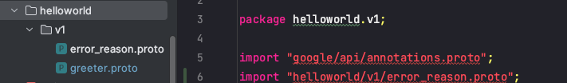
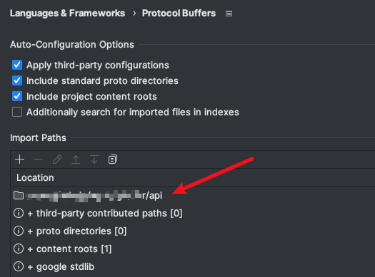
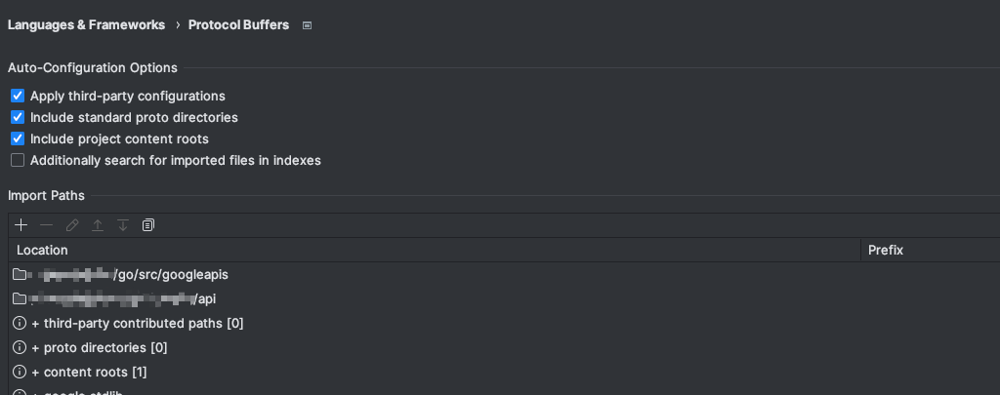

## protobuf

### protobuf规范

可以参考go-kratos的protocolbuf规范：https://go-kratos.dev/docs/guide/api-protobuf/

### 一个简单的文件 hello.proto：

```protobuf
syntax = "proto3"; // 协议的版本

// RequestURL: /<package_name>.<version>.<service_name>/{method}
package myapp.helloworld.v1;  //<package_name>.<version>; 应该跟目录保持一致

option go_package = "myapp.helloworld.v1;v1";	// 生成的go包路径;包名

// 定义服务
service Greeter {
  rpc Hello(Request) returns (Response) {}
}

message Request {
  string name = 1;
}

message Response {
  string greeting = 2;
}
```

proto 协议很容易理解：

- syntax = "proto3"; 标识我们协议的版本，每个版本的语言可能会有所不同，目前最新的使用最多的版本是 proto3它的语法你可以查看[官方文档](https://protobuf.dev/programming-guides/proto3/)；
- option go_package 定义生成的 Go 的 package 名；
- service Greeter 定义了一个服务 Greeter，它的远程方法为 Hello，Hello 参数为结构体 Request，返回值为结构体 Response。

### 编译并生成对应的.go文件

#### protoc编译器安装

要根据这个 proto 文件生成 Go 对应的协议文件，我们需要做一下前置的工作：**下载 proto 的编译器 protoc，**安装 protoc 指定版本的方式可以查看[官方的安装文档](https://grpc.io/docs/protoc-installation/)。

#### 安装protoc的go语言运行时插件

```shell
go install google.golang.org/protobuf/cmd/protoc-gen-go@latest
go install google.golang.org/grpc/cmd/protoc-gen-go-grpc@latest
```

#### 编译并生成对应的.go文件

关于生成代码可以查看[官方文档](https://protobuf.dev/reference/go/go-generated/#package)

```shell
protoc -I $GOPATH/src -I . --go_out=. --go-grpc_out=. hello.proto
```


### goland 设置 protobuf

插件安装：[Protocol Buffer官方插件](https://plugins.jetbrains.com/plugin/14004-protocol-buffers)


#### 插件搜索路径设置

Cannot resolve import 'google/api/annotations.proto' 或者 找不到 当前目录中的其他.proto文件



前往 settings -> Languages & Frameworks -> Protocol Buffers 进行设置，注意需要安装了上面插件才有这个设置选项，这个设置是针对当前项目的，对其他项目没影响。

比如这个helloworld文件夹是在 rootdir/api下，则添加api路径



如果还是标红，则关闭后重新打开该项目

添加 `google/api/annotations.proto` 路径，跟上面的设置原理一样，添加搜索路径，个人把googleapis的仓库clone到$GOPATH/src目录下的，googleapis仓库地址：https://github.com/googleapis/googleapis，最后设置如下：



然后重新goland

