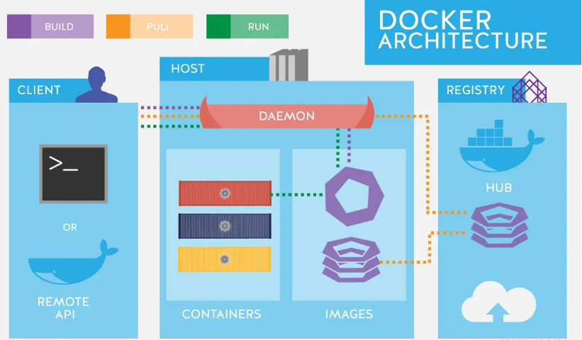

[TOC]

## docker介绍

Docker 是一个开源的应用容器引擎，让开发者可以打包他们的应用以及依赖包到一个可移植的镜像中，然后发布到任何流行的 Linux 或 Windows 机器上，也可以实现[虚拟化](https://link.juejin.cn?target=https%3A%2F%2Fso.csdn.net%2Fso%2Fsearch%3Fq%3D%E8%99%9A%E6%8B%9F%E5%8C%96%26spm%3D1001.2101.3001.7020)。容器是完全使用沙箱机制，相互之间不会有任何接口。
 开发人员利用 Docker 可以消除协作编码时 “在我的机器上可正常运作，而在你的机器上不能正常运作” 的问题。运维人员利用 Docker 可以在隔离容器中并行运行和管理应用，获得更好的计算密度。企业利用 Docker 可以构建敏捷的软件交付管道，以更快的速度、更高的安全性和可靠的信誉为 Linux 和 Windows Server 应用发布新功能。

## docker 架构

  Docker 使用 C/S 架构，Client 通过接口与 Server 进程通信实现容器的构建，运行和发布，如图：



### Docker Client (docker 客户端)

  Docker 命令行工具，用户通过 Docker Clients 与 Docker daemon 进行通信，利用命令行发送创建镜像、运行容器之类的请求。

### Docker Host (docker 宿主机)

  安装了 Docker 程序，并运行了 Docker daemon 的主机。其中 Docker Host 包含如下三部分：

1. Docker daemon (Docker 守护进程)

   运行在宿主机上，Docker 守护进程，用户通过 Docker client(Docker 命令) 与 Docker daemon 交互。

2. Images (镜像)

     将软件环境打包好的模板，用来创建容器的，一个镜像可以创建多个容器。

3. Containers (容器)

   Docker 的运行组件，启动一个镜像就是一个容器，容器与容器之间相互隔离，并且互不影响。

### Registry (仓库服务注册器)

经常会和仓库 (Repository) 混为一谈，实际上 Registry 上可以有多个仓库，每个仓库可以看成是一个用户， 一个用户的仓库放了多个镜像。仓库分为了公开仓库 (Public Repository) 和私有仓库(Private Repository)，最大的公开仓库是官方的 Docker Hub，国内也有如阿里云、时速云等，可以给国内用户提供稳定快速的服务。用户也可以在本地网络内创建一个私有仓库。当用户创建了自己的镜像之后就可以使用 push 命令将它上传到公有或者私有仓库，这样下次在另外一台机器上使用这个镜像时候，只需要从仓库上 pull 下来就可以了。

## Docker VS VMware

VM 是一个运行在宿主机之上的完整的操作系统，VM 运行自身操作系统会占用较多的 CPU、内存、硬盘资源。Docker 不同于 VM，只包含应用程序以及依赖库，基于 libcontainer 运行在宿主机上，并处于一个隔离的环境中，这使得 Docker 更加轻量高效，启动容器只需几秒钟之内完成。由于 Docker 轻量、资源占用少，使得 Docker 可以轻易的应用到构建标准化的应用中。

## CentOS7 操作系统安装 Docker CE (社区版)

**Docker官方安装文档（推荐）：[docs.docker.com/install/lin…](https://link.juejin.cn/?target=https%3A%2F%2Fdocs.docker.com%2Finstall%2Flinux%2Fdocker-ce%2Fcentos%2F)**

### 1、查看操作系统版本是否是 CentOS7 及以上

```shell
cat /etc/redhat-release
```

### 2、查看 CentOS7 的内核版本，Docker 要求 CentOS7 系统必须为 64 位，且系统内核版本为 3.10 及以上

```shell
uname -r
```

**提示：以下步骤请以`root用户`运行指令，如果不是以 root 用户运行，请在指令的最前面加上`sudo`，表示以系统管理者 (root) 的身份执行指令**

### 3、卸载旧版本 (如果之前没有安装过旧版本的 docker 可以跳过)

```shell
yum remove docker docker-client docker-client-latest docker-common docker-latest docker-latest-logrotate docker-logrotate docker-engine
```

### 4、安装 docker 所需的软件包

```shell
yum install -y yum-utils device-mapper-persistent-data lvm2	
```

### 5、设置 yum 源为阿里云 (由于国外网站访问速度慢)

```shell
yum-config-manager --add-repo http://mirrors.aliyun.com/docker-ce/linux/centos/docker-ce.repo
```

### 6、更新 yum 软件包索引

```shell
yum makecache fast
```

### 7、安装 docker CE(社区版)，Docker 提供了两个版本：社区版 (CE，免费) 和 企业版 (EE，收费)

```shell
yum -y install docker-ce
```

### 8、启动 docker，并加入到开机启动

```shell
//启动docker
systemctl start docker

//设置docker开机启动
systemctl enable docker

```

### 9、查看 docker 是否安装成功

```shell
docker version
```

**出现 Client 和 Service 两部分信息，则表示 docker 启动和安装都成功**

### 10、设置阿里云镜像加速器 (外国网站下载镜像速度慢)

1. 进入到[阿里云官网](https://link.juejin.cn/?target=https%3A%2F%2Fwww.aliyun.com%2F)，登录并点击右上角的控制台，进入到控制台页面**

   

2. **进入到控制台页面，在搜索框中输入 容器镜像服务并选择，进入到镜像仓库管理控制台**\

   

3. **进入到控制台页面后，在搜索框中输入 容器镜像服务并选择，进入到镜像仓库管理控制台，在进入时，需要设置镜像仓库管理控制台的用户名和密码，查看文档请点击：[阿里云镜像基本操作](https://link.juejin.cn/?target=https%3A%2F%2Fhelp.aliyun.com%2Fdocument_detail%2F60743.html%3Fspm%3Da2c4g.11186623.6.547.402411beYwUifE)**

   

4. **进入到镜像仓库管理控制台后，点击左边镜像中心下拉选项中的镜像加速器，最后点击复制链接，复制加速器地址，查看文档请点击：[阿里云官方镜像加速](https://link.juejin.cn/?target=https%3A%2F%2Fhelp.aliyun.com%2Fdocument_detail%2F60750.html%3Fspm%3Da2c4g.11186623.6.549.707c4685ctmKbx)**

   

5. **编辑 / etc/docker/daemon.json 配置文件 (如果有 daemon.json 配置文件则编辑，没有则会自动新建)**

   ```
   vi /etc/docker/daemon.json
   ```

6. **在 daemon.json 配置文件中，添加如下内容并保存：**

   ```json
   {
     "registry-mirrors": ["https://m0p0xxqj.mirror.aliyuncs.com"]
   }
   
   ```

7. ### 重新加载 daemon.json 配置文件 并 重启 docker 服务

   ```shell
   //重新加载daemon.json配置文件
   systemctl daemon-reload
   
   //重启服务器
   systemctl restart docker
   
   ```

### 11、重新加载 daemon.json 配置文件 并 重启 docker 服务

```shell
//重新加载daemon.json配置文件
systemctl daemon-reload

//重启服务器
systemctl restart docker


```

### 12、查看阿里云镜像加速器是否配置成功

```shell
docker info
```

**找到 Registry Mirrors，在其下方显示的就是我们配置的镜像加速器地址**

**到这，docker CE(社区版) 就安装成功了**

文章来源：https://juejin.cn/post/7154437479955693598

docker-从入门到实战: https://yeasy.gitbook.io/docker_practice/

视频学习：https://www.bilibili.com/video/BV1HP4118797/?vd_source=c0f6eeeede4ef469d92c3b6ad38b82b3

```
echo \
  "deb [arch=$(dpkg --print-architecture) signed-by=/etc/apt/keyrings/docker.gpg] https://mirrors.aliyun.com/docker-ce/linux/ubuntu \
  $(. /etc/os-release && echo "$VERSION_CODENAME") stable" | \
  sudo tee /etc/apt/sources.list.d/docker.list > /dev/null


```

