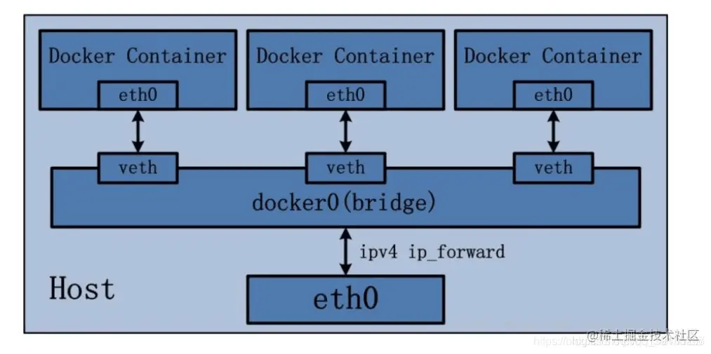
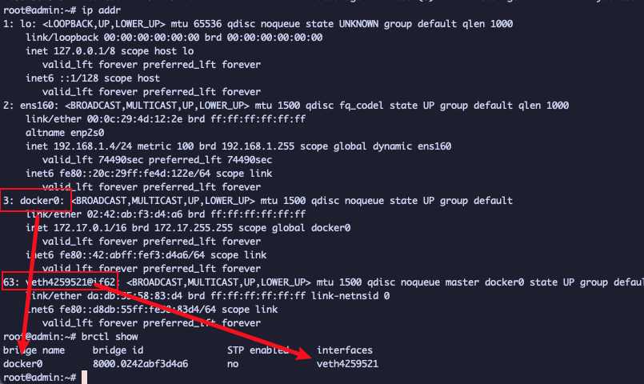
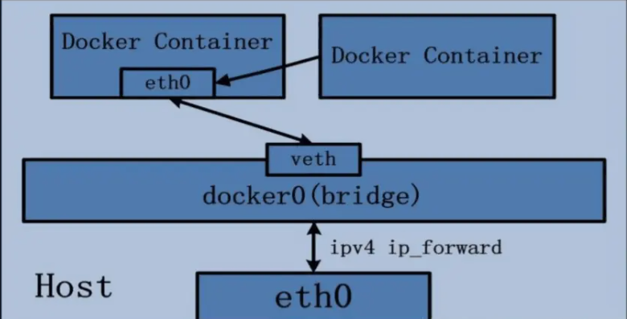

[TOC]


    当项目大规模使用 Docker 时，容器通信的问题也就产生了。要解决容器通信问题，必须先了解很多关于网络的知识。Docker 作为目前最火的轻量级容器技术，有很多令人称道的功能，如 Docker 的镜像管理。然而，Docker 同样有着很多不完善的地方，网络方面就是 Docker 比较薄弱的部分。因此，我们有必要深入了解 Docker 的网络知识，以满足更高的网络需求。

容器的网络IP其实是一个虚拟的IP，其值并不固定与某一个容器绑定，如果我们在开发时写死某个IP，而在部署时很可能MySQL容器的IP会发生变化，连接会失败。

所以，我们必须借助于docker的网络功能来解决这个问题，官方文档：

https://docs.docker.com/engine/reference/commandline/network/


## docker 网络模式介绍

### 默认网络

在安装完 Docker 以后，会默认创建三种网络，可以通过`docker network ls`命令查看

```shell
root@admin:~# docker network ls
NETWORK ID     NAME      DRIVER    SCOPE
55cba9e16c50   bridge    bridge    local
b3877d788dea   host      host      local
71df15dabad5   non
```

在学习 Docker 网络之前，我们有必要先来了解一下这几种网络模式都是什么意思

| 网络模式  | 简介                                                         |
| --------- | ------------------------------------------------------------ |
| bridge    | 为每一个容器分配、设置 IP 等，并将容器连接到一个`docker0`虚拟网桥，默认为该模式。 |
| host      | 容器将不会虚拟出自己的网卡，配置自己的 IP 等，而是使用宿主机的 IP 和端口。 |
| none      | 容器有独立的 Network namespace，但并没有对其进行任何网络设置，如分配 veth pair 和网桥连接，IP 等。 |
| container | 新创建的容器不会创建自己的网卡和配置自己的 IP，而是和一个指定的容器共享 IP、端口范围等。(`不属于默认网络，但在Kubernetes中会使用到`) |

常见命令有：

| **命令**                  | **说明**                 | **文档地址**                                                 |
| :------------------------ | :----------------------- | :----------------------------------------------------------- |
| docker network create     | 创建一个网络             | [docker network create](https://docs.docker.com/engine/reference/commandline/network_create/) |
| docker network ls         | 查看所有网络             | [docs.docker.com](https://docs.docker.com/engine/reference/commandline/network_ls/) |
| docker network rm         | 删除指定网络             | [docs.docker.com](https://docs.docker.com/engine/reference/commandline/network_rm/) |
| docker network prune      | 清除未使用的网络         | [docs.docker.com](https://docs.docker.com/engine/reference/commandline/network_prune/) |
| docker network connect    | 使指定容器连接加入某网络 | [docs.docker.com](https://docs.docker.com/engine/reference/commandline/network_connect/) |
| docker network disconnect | 使指定容器连接离开某网络 | [docker network disconnect](https://docs.docker.com/engine/reference/commandline/network_disconnect/) |
| docker network inspect    | 查看网络详细信息         | [docker network inspect](https://docs.docker.com/engine/reference/commandline/network_inspect/) |

#### bridge 网络模式

    在该模式中，Docker 守护进程创建了一个虚拟以太网桥 `docker0`，新建的容器会自动桥接到这个接口，附加在其上的任何网卡之间都能自动转发数据包。

 默认情况下，守护进程会创建一对对等虚拟设备接口 `veth pair`，将其中一个接口设置为容器的 `eth0` 接口（容器的网卡），另一个接口放置在宿主机的命名空间中，以类似 `vethxxx` 这样的名字命名，从而将宿主机上的所有容器都连接到这个内部网络上。

    关于 `bridge` 网络模式的使用，只需要在创建容器时通过参数 `--net bridge` 或者 `--network bridge` 指定即可，当然这也是创建容器默认使用的网络模式，也就是说这个参数是可以省略的。



Bridge 桥接模式的实现步骤主要如下：

- Docker Daemon 利用 veth pair 技术，在宿主机上创建一对对等虚拟网络接口设备，假设为 veth0 和 veth1。而 veth pair 技术的特性可以保证无论哪一个 veth 接收到网络报文，都会将报文传输给另一方。
- Docker Daemon 将 veth0 附加到 Docker Daemon 创建的 docker0 网桥上。保证宿主机的网络报文可以发往 veth0。
- Docker Daemon 将 veth1 添加到 Docker Container 所属的 namespace 下，并被改名为 eth0。如此一来，宿主机的网络报文若发往 veth0，则立即会被 Container 的 eth0 接收，实现宿主机到 Docker Container 网络的联通性；同时，也保证 Docker Container 单独使用 eth0，实现容器网络环境的隔离性。

演示案例：

1、运行一个基于`busybox` 镜像构建的容器 `mybox`，并查看容器的`ip`地址信息

```shell
root@admin:~# docker run -it --name=mybox busybox
Unable to find image 'busybox:latest' locally
latest: Pulling from library/busybox
a01966dde7f8: Pull complete
Digest: sha256:5acba83a746c7608ed544dc1533b87c737a0b0fb730301639a0179f9344b1678
Status: Downloaded newer image for busybox:latest
/ # ip addr
1: lo: <LOOPBACK,UP,LOWER_UP> mtu 65536 qdisc noqueue qlen 1000
    link/loopback 00:00:00:00:00:00 brd 00:00:00:00:00:00
    inet 127.0.0.1/8 scope host lo
       valid_lft forever preferred_lft forever
60: eth0@if61: <BROADCAST,MULTICAST,UP,LOWER_UP,M-DOWN> mtu 1500 qdisc noqueue
    link/ether 02:42:ac:11:00:02 brd ff:ff:ff:ff:ff:ff
    inet 172.17.0.2/16 brd 172.17.255.255 scope global eth0
       valid_lft forever preferred_lft forever
/ # exit
```

可以看到`mybox`容器有一个`lo 本地回环地址` 和 一个`60: eth0@if61`网卡

2、查看宿主机的`ip`地址信息

```shell
root@admin:~# ip addr
1: lo: <LOOPBACK,UP,LOWER_UP> mtu 65536 qdisc noqueue state UNKNOWN group default qlen 1000
    link/loopback 00:00:00:00:00:00 brd 00:00:00:00:00:00
    inet 127.0.0.1/8 scope host lo
       valid_lft forever preferred_lft forever
    inet6 ::1/128 scope host
       valid_lft forever preferred_lft forever
2: ens160: <BROADCAST,MULTICAST,UP,LOWER_UP> mtu 1500 qdisc fq_codel state UP group default qlen 1000
    link/ether 00:0c:29:4d:12:2e brd ff:ff:ff:ff:ff:ff
    altname enp2s0
    inet 192.168.1.4/24 metric 100 brd 192.168.1.255 scope global dynamic ens160
       valid_lft 74490sec preferred_lft 74490sec
    inet6 fe80::20c:29ff:fe4d:122e/64 scope link
       valid_lft forever preferred_lft forever
3: docker0: <BROADCAST,MULTICAST,UP,LOWER_UP> mtu 1500 qdisc noqueue state UP group default
    link/ether 02:42:ab:f3:d4:a6 brd ff:ff:ff:ff:ff:ff
    inet 172.17.0.1/16 brd 172.17.255.255 scope global docker0
       valid_lft forever preferred_lft forever
    inet6 fe80::42:abff:fef3:d4a6/64 scope link
       valid_lft forever preferred_lft forever
63: veth4259521@if62: <BROADCAST,MULTICAST,UP,LOWER_UP> mtu 1500 qdisc noqueue master docker0 state UP group default
    link/ether da:db:55:58:83:d4 brd ff:ff:ff:ff:ff:ff link-netnsid 0
    inet6 fe80::d8db:55ff:fe58:83d4/64 scope link
       valid_lft forever preferred_lft forever
```

可以看到宿主机有一个`lo 本地回环地址`、一个`ens160`网卡 (即：`eth0`)、一个`docker0`网桥

通过以上的比较可以发现，证实了之前所说的：守护进程会创建一对对等的虚拟设备接口 `veth pair`，将其中一个接口设置为容器的 `eth0` 接口（容器的网卡，即上图容器`mybox`的 `60: eth0@if61`网卡），另一个接口放置在宿主机的命名空间中，以类似 `vethxxx` 这样的名字命名 (即：上图宿主机的`63: veth4259521@if62`网卡)。

同时，守护进程还会从网桥 `docker0` 的私有地址空间中分配一个 `ip` 地址和子网给该容器，并设置 `docker0` 的 `ip` 地址为容器的默认网关。也可以安装 `yum install -y bridge-utils` （ubuntu使用 `apt install bridge-utils`）以后，通过 `brctl show` 命令查看网桥信息。



对于每个容器的 `IP` 地址和 `Gateway` 信息，我们可以通过 `docker inspect 容器名称|ID` 进行查看，在 `NetworkSettings` 节点中可以看到详细信息。

```shell
 "NetworkSettings": {
            "Bridge": "",
            "SandboxID": "7c3c001a032586a53c5ae223ce9020ca3e6c5df257f0c7e3b15d0894b4fea19a",
            "HairpinMode": false,
            "LinkLocalIPv6Address": "",
            "LinkLocalIPv6PrefixLen": 0,
            "Ports": {},
            "SandboxKey": "/var/run/docker/netns/7c3c001a0325",
            "SecondaryIPAddresses": null,
            "SecondaryIPv6Addresses": null,
            "EndpointID": "61ce47f6f6a4cea65ceec946a7c969488373f52ed1b02775799d6b683f540b5e",
            "Gateway": "172.17.0.1",
            "GlobalIPv6Address": "",
            "GlobalIPv6PrefixLen": 0,
            "IPAddress": "172.17.0.2",
            "IPPrefixLen": 16,
            "IPv6Gateway": "",
            "MacAddress": "02:42:ac:11:00:02",
            "Networks": {
                "bridge": {
                    "IPAMConfig": null,
                    "Links": null,
                    "Aliases": null,
                    "NetworkID": "55cba9e16c504b89eca90d2823bc7854a64217490944187906f8c5a407454544",
                    "EndpointID": "61ce47f6f6a4cea65ceec946a7c969488373f52ed1b02775799d6b683f540b5e",
                    "Gateway": "172.17.0.1",
                    "IPAddress": "172.17.0.2",
                    "IPPrefixLen": 16,
                    "IPv6Gateway": "",
                    "GlobalIPv6Address": "",
                    "GlobalIPv6PrefixLen": 0,
                    "MacAddress": "02:42:ac:11:00:02",
                    "DriverOpts": null
                }
            }
        }
```

可以看到 `Gateway`网关地址为 `docker0` 的 `ip` 地址 `172.17.0.1`，容器的`ip`地址为`172.17.0.2`

我们还可以通过 `docker network inspect bridge` 查看所有 `bridge` 网络模式下的容器，在 `Containers` 节点中可以看到容器名称。

```shell
root@admin:~# docker network inspect bridge
[
    {
        "Name": "bridge",
        "Id": "55cba9e16c504b89eca90d2823bc7854a64217490944187906f8c5a407454544",
        "Created": "2023-12-13T06:35:18.299044464Z",
        "Scope": "local",
        "Driver": "bridge",
        "EnableIPv6": false,
        "IPAM": {
            "Driver": "default",
            "Options": null,
            "Config": [
                {
                    "Subnet": "172.17.0.0/16",
                    "Gateway": "172.17.0.1"
                }
            ]
        },
        "Internal": false,
        "Attachable": false,
        "Ingress": false,
        "ConfigFrom": {
            "Network": ""
        },
        "ConfigOnly": false,
        "Containers": {
            "5bf960b272b2e3e7ec88cb87f88ec83a9ffeb455b2f3dc240e9fb58716d64ae5": {
                "Name": "mybox",
                "EndpointID": "61ce47f6f6a4cea65ceec946a7c969488373f52ed1b02775799d6b683f540b5e",
                "MacAddress": "02:42:ac:11:00:02",
                "IPv4Address": "172.17.0.2/16",
                "IPv6Address": ""
            }
        },
        "Options": {
            "com.docker.network.bridge.default_bridge": "true",
            "com.docker.network.bridge.enable_icc": "true",
            "com.docker.network.bridge.enable_ip_masquerade": "true",
            "com.docker.network.bridge.host_binding_ipv4": "0.0.0.0",
            "com.docker.network.bridge.name": "docker0",
            "com.docker.network.driver.mtu": "1500"
        },
        "Labels": {}
    }
]
root@admin:~#
```

#### host 网络模式

`host` 网络模式需要在创建容器时通过参数 `--net host` 或者 `--network host` 指定。

    采用 `host` 网络模式的 `Docker Container`，可以直接使用宿主机的 `ip` 地址与外界进行通信，若宿主机的 `eth0` 是一个公有 `ip`，那么容器也拥有这个公有 `ip`。同时容器内服务的端口也可以使用宿主机的端口，无需额外进行 `NAT` 转换。

    `host` 网络模式可以让容器共享宿主机网络栈，这样的好处是外部主机与容器直接通信，但是容器的网络缺少隔离性。


演示案例：

1、运行一个基于`busybox` 镜像构建的容器 `hostbox`，并查看容器的 ip 地址信息

```shell
docker run -it --name=hostbox --net host busybox
/ # ip addr
1: lo: <LOOPBACK,UP,LOWER_UP> mtu 65536 qdisc noqueue qlen 1000
    link/loopback 00:00:00:00:00:00 brd 00:00:00:00:00:00
    inet 127.0.0.1/8 scope host lo
       valid_lft forever preferred_lft forever
    inet6 ::1/128 scope host
       valid_lft forever preferred_lft forever
2: ens160: <BROADCAST,MULTICAST,UP,LOWER_UP> mtu 1500 qdisc fq_codel qlen 1000
    link/ether 00:0c:29:4d:12:2e brd ff:ff:ff:ff:ff:ff
    inet 192.168.1.4/24 brd 192.168.1.255 scope global dynamic ens160
       valid_lft 73796sec preferred_lft 73796sec
    inet6 fe80::20c:29ff:fe4d:122e/64 scope link
       valid_lft forever preferred_lft forever
3: docker0: <BROADCAST,MULTICAST,UP,LOWER_UP> mtu 1500 qdisc noqueue
    link/ether 02:42:ab:f3:d4:a6 brd ff:ff:ff:ff:ff:ff
    inet 172.17.0.1/16 brd 172.17.255.255 scope global docker0
       valid_lft forever preferred_lft forever
    inet6 fe80::42:abff:fef3:d4a6/64 scope link
       valid_lft forever preferred_lft forever
63: veth4259521@if62: <BROADCAST,MULTICAST,UP,LOWER_UP,M-DOWN> mtu 1500 qdisc noqueue master docker0
    link/ether da:db:55:58:83:d4 brd ff:ff:ff:ff:ff:ff
    inet6 fe80::d8db:55ff:fe58:83d4/64 scope link
       valid_lft forever preferred_lft forever
/ #
```

可以看到`hostbox`容器有一个`lo 本地回环地址`、一个`ens160`网卡 (即：`eth0`) 和 一个`docker0`网桥

2、查看宿主机的 ip 地址信息

```shell
root@admin:~# ip addr
1: lo: <LOOPBACK,UP,LOWER_UP> mtu 65536 qdisc noqueue state UNKNOWN group default qlen 1000
    link/loopback 00:00:00:00:00:00 brd 00:00:00:00:00:00
    inet 127.0.0.1/8 scope host lo
       valid_lft forever preferred_lft forever
    inet6 ::1/128 scope host
       valid_lft forever preferred_lft forever
2: ens160: <BROADCAST,MULTICAST,UP,LOWER_UP> mtu 1500 qdisc fq_codel state UP group default qlen 1000
    link/ether 00:0c:29:4d:12:2e brd ff:ff:ff:ff:ff:ff
    altname enp2s0
    inet 192.168.1.4/24 metric 100 brd 192.168.1.255 scope global dynamic ens160
       valid_lft 73701sec preferred_lft 73701sec
    inet6 fe80::20c:29ff:fe4d:122e/64 scope link
       valid_lft forever preferred_lft forever
3: docker0: <BROADCAST,MULTICAST,UP,LOWER_UP> mtu 1500 qdisc noqueue state UP group default
    link/ether 02:42:ab:f3:d4:a6 brd ff:ff:ff:ff:ff:ff
    inet 172.17.0.1/16 brd 172.17.255.255 scope global docker0
       valid_lft forever preferred_lft forever
    inet6 fe80::42:abff:fef3:d4a6/64 scope link
       valid_lft forever preferred_lft forever
63: veth4259521@if62: <BROADCAST,MULTICAST,UP,LOWER_UP> mtu 1500 qdisc noqueue master docker0 state UP group default
    link/ether da:db:55:58:83:d4 brd ff:ff:ff:ff:ff:ff link-netnsid 0
    inet6 fe80::d8db:55ff:fe58:83d4/64 scope link
       valid_lft forever preferred_lft forever
```

可以看到宿主机的`ip`地址信息跟上图的`hostbox`容器的`ip`地址信息是一模一样的

我们还可以通过 `docker network inspect host` 查看所有 `host` 网络模式下的容器，在 `Containers` 节点中可以看到容器名称。（注意：需要保证容器是运行状态，通过 `docker ps -a` 查看是否是运行状态，如果不是运行状态，先运行容器，否则是看不到容器的信息）

```shell
root@admin:~# docker network inspect host
[
    {
        "Name": "host",
        "Id": "b3877d788dead5e1d888e10cb9206dbdc5f52217785d6e959c6f824021adde6f",
        "Created": "2023-12-13T06:32:21.022836893Z",
        "Scope": "local",
        "Driver": "host",
        "EnableIPv6": false,
        "IPAM": {
            "Driver": "default",
            "Options": null,
            "Config": []
        },
        "Internal": false,
        "Attachable": false,
        "Ingress": false,
        "ConfigFrom": {
            "Network": ""
        },
        "ConfigOnly": false,
        "Containers": {
            "ce970454e8a5a9e67bc42afd6334afce25f85ea255bb7edb36c9585d1f501cd0": {
                "Name": "hostbox",
                "EndpointID": "591fb9717689c72b71885d2f5afcab6793051e30b88e8e9034f86ceacd262b11",
                "MacAddress": "",
                "IPv4Address": "",
                "IPv6Address": ""
            }
        },
        "Options": {},
        "Labels": {}
    }
]
root@admin:~#
```

#### none 网络模式

    `none` 网络模式是指禁用网络功能，只有 `lo` 地址 (`local` 的简写)，代表 `127.0.0.1`，即 `localhost` 本地回环地址。在创建容器时通过参数 `--net none` 或者 `--network none` 指定。

    `none` 网络模式即不为 `Docker Container` 创建任何的网络环境，容器内部就只能使用 `loopback` 网络设备，不会再有其他的网络资源。可以说 `none` 模式为 `Docke Container` 做了极少的网络设定，但是俗话说得好 “少即是多”，在没有网络配置的情况下，作为 `Docker` 开发者，才能在这基础做其他无限多可能的网络定制开发。这也恰巧体现了 `Docker` 设计理念的开放

演示案例：

运行一个基于`busybox` 镜像构建的容器 `nonebox`，并查看容器的 ip 地址信息

```shell
root@admin:~# docker run -it --name=nonebox --net none busybox
/ # ip addr
1: lo: <LOOPBACK,UP,LOWER_UP> mtu 65536 qdisc noqueue qlen 1000
    link/loopback 00:00:00:00:00:00 brd 00:00:00:00:00:00
    inet 127.0.0.1/8 scope host lo
       valid_lft forever preferred_lft forever
/ # exit
```

可以看到`nonebox`容器有一个`lo 本地回环地址`

我们还可以通过 `docker network inspect none` 查看所有 `none` 网络模式下的容器，在 `Containers` 节点中可以看到容器名称。

```shell
root@admin:~# docker network inspect none
[
    {
        "Name": "none",
        "Id": "71df15dabad58c41384067245dbc0056fb9214ad47db0bf66b4e246102f1740d",
        "Created": "2023-12-13T06:32:21.018106264Z",
        "Scope": "local",
        "Driver": "null",
        "EnableIPv6": false,
        "IPAM": {
            "Driver": "default",
            "Options": null,
            "Config": []
        },
        "Internal": false,
        "Attachable": false,
        "Ingress": false,
        "ConfigFrom": {
            "Network": ""
        },
        "ConfigOnly": false,
        "Containers": {
            "171a85b2e3beb5e9f49269c96d5e4af574cfea9cc1b12052b111c22fdefe774e": {
                "Name": "nonebox",
                "EndpointID": "5f61990a8c3a66723ffd86e01f5b88026db59978dbccc504872e3f2df2957cf6",
                "MacAddress": "",
                "IPv4Address": "",
                "IPv6Address": ""
            }
        },
        "Options": {},
        "Labels": {}
    }
]
```

#### container 网络模式

 `Container` 网络模式是 `Docker` 中一种较为特别的网络的模式。在创建容器时通过参数 `--net container:已运行的容器名称|ID` 或者 `--network container:已运行的容器名称|ID` 指定。

    处于这个模式下的 `Docker` 容器会共享一个网络栈，这样两个容器之间可以使用 `localhost` 高效快速通信。



**`Container` 网络模式即新创建的容器不会创建自己的网卡，配置自己的 `ip`，而是和一个指定的容器共享 `ip`、端口范围等。** 同样两个容器除了网络方面相同之外，其他的如文件系统、进程列表等还是隔离的。

演示案例：

1、运行一个基于`bridge`网络模式的`mybox` 容器创建`container`网络模式的容器 `containerbox`，并查看容器的`ip`地址信息

```shell
#启动原先的mybox容器
root@admin:~# docker start mybox

# 运行contanierbox 容器
root@admin:~# docker run -it --name=containerbox --net container:mybox busybox
/ # ip addr
1: lo: <LOOPBACK,UP,LOWER_UP> mtu 65536 qdisc noqueue qlen 1000
    link/loopback 00:00:00:00:00:00 brd 00:00:00:00:00:00
    inet 127.0.0.1/8 scope host lo
       valid_lft forever preferred_lft forever
62: eth0@if63: <BROADCAST,MULTICAST,UP,LOWER_UP,M-DOWN> mtu 1500 qdisc noqueue
    link/ether 02:42:ac:11:00:02 brd ff:ff:ff:ff:ff:ff
    inet 172.17.0.2/16 brd 172.17.255.255 scope global eth0
       valid_lft forever preferred_lft forever
/ #
```

可以看到`containerbox`容器有一个`lo 本地回环地址` 和 一个`4: 62: eth0@if63`网卡

2、查看`mybox` 容器的`ip`地址信息

```shell
root@admin:~# docker exec -it mybox ip addr
1: lo: <LOOPBACK,UP,LOWER_UP> mtu 65536 qdisc noqueue qlen 1000
    link/loopback 00:00:00:00:00:00 brd 00:00:00:00:00:00
    inet 127.0.0.1/8 scope host lo
       valid_lft forever preferred_lft forever
62: eth0@if63: <BROADCAST,MULTICAST,UP,LOWER_UP,M-DOWN> mtu 1500 qdisc noqueue
    link/ether 02:42:ac:11:00:02 brd ff:ff:ff:ff:ff:ff
    inet 172.17.0.2/16 brd 172.17.255.255 scope global eth0
       valid_lft
```

可以看到`mybox` 容器的`ip`地址信息跟上图的`containerbox`容器的`ip`地址信息是一模一样的

3、查看宿主机的`ip`地址信息

```shell
root@admin:~# ip addr
1: lo: <LOOPBACK,UP,LOWER_UP> mtu 65536 qdisc noqueue state UNKNOWN group default qlen 1000
    link/loopback 00:00:00:00:00:00 brd 00:00:00:00:00:00
    inet 127.0.0.1/8 scope host lo
       valid_lft forever preferred_lft forever
    inet6 ::1/128 scope host
       valid_lft forever preferred_lft forever
2: ens160: <BROADCAST,MULTICAST,UP,LOWER_UP> mtu 1500 qdisc fq_codel state UP group default qlen 1000
    link/ether 00:0c:29:4d:12:2e brd ff:ff:ff:ff:ff:ff
    altname enp2s0
    inet 192.168.1.4/24 metric 100 brd 192.168.1.255 scope global dynamic ens160
       valid_lft 72848sec preferred_lft 72848sec
    inet6 fe80::20c:29ff:fe4d:122e/64 scope link
       valid_lft forever preferred_lft forever
3: docker0: <BROADCAST,MULTICAST,UP,LOWER_UP> mtu 1500 qdisc noqueue state UP group default
    link/ether 02:42:ab:f3:d4:a6 brd ff:ff:ff:ff:ff:ff
    inet 172.17.0.1/16 brd 172.17.255.255 scope global docker0
       valid_lft forever preferred_lft forever
    inet6 fe80::42:abff:fef3:d4a6/64 scope link
       valid_lft forever preferred_lft forever
63: veth4259521@if62: <BROADCAST,MULTICAST,UP,LOWER_UP> mtu 1500 qdisc noqueue master docker0 state UP group default
    link/ether da:db:55:58:83:d4 brd ff:ff:ff:ff:ff:ff link-netnsid 0
    inet6 fe80::d8db:55ff:fe58:83d4/64 scope link
       valid_lft forever preferred_lft forever
root@admin:~#
```

这个时候如果将`mybox`容器停止，会发现`containerbox` 容器就只剩下 `lo 本地回环地址`了，如果`mybox`容器重启以后，`containerbox` 容器也重启一下，就又可以获取到网卡信息了

### 自定义网络

 虽然 `Docker` 提供的默认网络使用比较简单，但是为了保证各容器中应用的安全性，在实际开发中更推荐使用自定义的网络进行容器管理，以及启用容器名称到 `ip` 地址的自动 `DNS` 解析。

    从 `Docker 1.10` 版本开始，`docker daemon` 实现了一个内嵌的 `DNS server`，使容器可以直接通过容器名称通信。方法很简单，只要在创建容器时使用 `--name` 为容器命名即可。

    但是使用 `Docker DNS` 有个限制：只能在 `user-defined` 网络中使用。也就是说，默认的 `bridge` 网络是无法使用 `DNS` 的，所以我们就需要自定义网络。

从 `Docker 1.10` 版本开始，`docker daemon` 实现了一个内嵌的 `DNS server`，使容器可以直接通过容器名称通信。方法很简单，只要在创建容器时使用 `--name` 为容器命名即可。

但是使用 `Docker DNS` 有个限制：只能在 `user-defined` 网络中使用。也就是说，默认的 `bridge` 网络是无法使用 `DNS` 的，所以我们就需要自定义网络。

#### 创建网络

1、通过 `docker network create` 命令可以创建自定义网络模式，查看 `docker network create` 命令使用详情，发现可以通过 `-d` 或者 `--driver` 指定网络模式且默认是 `bridge` 网络模式，命令提示如下：

```shell
root@admin:~# docker network create --help

Usage:  docker network create [OPTIONS] NETWORK

Create a network

Options:
      --attachable           Enable manual container attachment
      --aux-address map      Auxiliary IPv4 or IPv6 addresses used by Network driver (default map[])
      --config-from string   The network from which to copy the configuration
      --config-only          Create a configuration only network
  -d, --driver string        Driver to manage the Network (default "bridge")
      --gateway strings      IPv4 or IPv6 Gateway for the master subnet
      --ingress              Create swarm routing-mesh network
      --internal             Restrict external access to the network
      --ip-range strings     Allocate container ip from a sub-range
      --ipam-driver string   IP Address Management Driver (default "default")
      --ipam-opt map         Set IPAM driver specific options (default map[])
      --ipv6                 Enable IPv6 networking
      --label list           Set metadata on a network
  -o, --opt map              Set driver specific options (default map[])
      --scope string         Control the network's scope
      --subnet strings       Subnet in CIDR format that represents a network segment
root@admin:~#
```

2、创建一个基于 `bridge` 网络模式的自定义网络模式 `custom_network`，完整命令如下：

```shell
docker network create custom_network
或者
docker network create -d bridge custom_network
```

3、通过 `docker network ls` 查看本地网络：

```shell
root@admin:~# docker network create custom_network
cc2ecd9af2ca1d81d2cc9d28fcd730db09b7f56707a99df5657bf5ff345897fa
root@admin:~# docker network ls
NETWORK ID     NAME             DRIVER    SCOPE
55cba9e16c50   bridge           bridge    local
cc2ecd9af2ca   custom_network   bridge    local
b3877d788dea   host             host      local
71df15dabad5   none             null      local
root@admin:~#
```

4、通过自定义网络模式 `custom_network` 创建容器：

```shell
root@admin:~# docker run -di --name=custombox --net custom_network busybox
de492849a9e92bf83abe4db1ca7b4c3f1e22bd2a5a40116b889d8c03026159be
```

5、可以通过 `docker inspect 容器名称|ID` 查看容器的网络信息，在 `NetworkSettings` 节点中可以看到详细信息

```shell
root@admin:~# docker inspect custombox
# ....
"Networks": {
                "custom_network": {
                    "IPAMConfig": null,
                    "Links": null,
                    "Aliases": [
                        "de492849a9e9"
                    ],
                    "NetworkID": "cc2ecd9af2ca1d81d2cc9d28fcd730db09b7f56707a99df5657bf5ff345897fa",
                    "EndpointID": "7d4d0982269061b350cad91bd3e6bb2457b271bee5b1c3c2b7cd06a0e9db5a43",
                    "Gateway": "172.18.0.1",
                    "IPAddress": "172.18.0.2",
                    "IPPrefixLen": 16,
                    "IPv6Gateway": "",
                    "GlobalIPv6Address": "",
                    "GlobalIPv6PrefixLen": 0,
                    "MacAddress": "02:42:ac:12:00:02",
                    "DriverOpts": null
                }
            }
```

#### 连接网络

1、通过 `docker network connect 网络名称 容器名称` 为容器连接新的网络模式，这里我们为`mybox`容器添加`custom_network`网络

```shell
root@admin:~# docker inspect mybox
"Networks": {
                "bridge": {
                    "IPAMConfig": null,
                    "Links": null,
                    "Aliases": null,
                    "NetworkID": "55cba9e16c504b89eca90d2823bc7854a64217490944187906f8c5a407454544",
                    "EndpointID": "a11d6106fe93cd7a168a1c38ae7c5b7170bcabd186ca5536497bfb245edf85eb",
                    "Gateway": "172.17.0.1",
                    "IPAddress": "172.17.0.2",
                    "IPPrefixLen": 16,
                    "IPv6Gateway": "",
                    "GlobalIPv6Address": "",
                    "GlobalIPv6PrefixLen": 0,
                    "MacAddress": "02:42:ac:11:00:02",
                    "DriverOpts": null
                },
                "custom_network": {
                    "IPAMConfig": {},
                    "Links": null,
                    "Aliases": [
                        "5bf960b272b2"
                    ],
                    "NetworkID": "cc2ecd9af2ca1d81d2cc9d28fcd730db09b7f56707a99df5657bf5ff345897fa",
                    "EndpointID": "56c1a9b33010bd5b57fc835f3fc24b3a28218a1188fe064cf312928b7620542e",
                    "Gateway": "172.18.0.1",
                    "IPAddress": "172.18.0.3",
                    "IPPrefixLen": 16,
                    "IPv6Gateway": "",
                    "GlobalIPv6Address": "",
                    "GlobalIPv6PrefixLen": 0,
                    "MacAddress": "02:42:ac:12:00:03",
                    "DriverOpts": {}
                }
            }
```

#### 断开网络

1、通过 `docker network disconnect 网络名称 容器名称` 命令断开网络

```shell
root@admin:~# docker network disconnect custom_network mybox
root@admin:~#
root@admin:~# docker inspect mybox
"Networks": {
                "bridge": {
                    "IPAMConfig": null,
                    "Links": null,
                    "Aliases": null,
                    "NetworkID": "55cba9e16c504b89eca90d2823bc7854a64217490944187906f8c5a407454544",
                    "EndpointID": "a11d6106fe93cd7a168a1c38ae7c5b7170bcabd186ca5536497bfb245edf85eb",
                    "Gateway": "172.17.0.1",
                    "IPAddress": "172.17.0.2",
                    "IPPrefixLen": 16,
                    "IPv6Gateway": "",
                    "GlobalIPv6Address": "",
                    "GlobalIPv6PrefixLen": 0,
                    "MacAddress": "02:42:ac:11:00:02",
                    "DriverOpts": null
                }
            }
```

#### 移除网络

可以通过 `docker network rm 网络名称` 命令移除`自定义`的网络，网络移除成功则会返回自定义的网络名称

```shell
root@admin:~# docker stop custombox
custombox
root@admin:~# docker network rm custom_network
custom_network
root@admin:~# docker network ls
NETWORK ID     NAME      DRIVER    SCOPE
55cba9e16c50   bridge    bridge    local
b3877d788dea   host      host      local
71df15dabad5   none      null      local
root@admin:~#
```

`提示`：如果某个自定义网络模式被创建的容器使用了，则该网络模式无法被删除。

### 容器间的网络通信

接下来我们通过所学的知识实现容器间的网络通信。首先明确一点，容器之间要想互相通信，必须要有属于同一个网络的网卡。

1、我们先创建两个基于默认的 `bridge` 网络模式的容器

```shell
root@admin:~# docker run -di --name=box busybox
01c9236acd9ed3d8e3d4afed3a5bab866f54e87fbea871a0bf520c300c0084b8
root@admin:~# docker run -di --name=otherbox busybox
b6e90bed946e8928ea46a3045fd8d9d171696ca45c4b975b10e5c8653c0fb613
root@admin:~# docker ps -a
CONTAINER ID   IMAGE     COMMAND                  CREATED             STATUS                            PORTS     NAMES
b6e90bed946e   busybox   "sh"                     9 seconds ago       Up 8 seconds                                otherbox
01c9236acd9e   busybox   "sh"                     14 seconds ago      Up 13 seconds                               box
```

2、通过 `docker network inspect bridge` 查看两容器的具体 `ip` 信息

```shell
root@admin:~# docker network inspect bridge
        "Containers": {
            "01c9236acd9ed3d8e3d4afed3a5bab866f54e87fbea871a0bf520c300c0084b8": {
                "Name": "box",
                "EndpointID": "9ae7fc41960fb3a403cda8058f5a2f5c49abfebcec983245209069ce067e5bdc",
                "MacAddress": "02:42:ac:11:00:03",
                "IPv4Address": "172.17.0.3/16",
                "IPv6Address": ""
            },
            "b6e90bed946e8928ea46a3045fd8d9d171696ca45c4b975b10e5c8653c0fb613": {
                "Name": "otherbox",
                "EndpointID": "6eb3492fc3dcb4de8c905f4e0d3bedbfee7c154cdd9b69025f4f8164a0915927",
                "MacAddress": "02:42:ac:11:00:04",
                "IPv4Address": "172.17.0.4/16",
                "IPv6Address": ""
            }
        },
```

可以看到容器`box`的 ip 地址为`172.17.0.3`，容器`otherbox`的`ip`地址为`172.17.0.4`

3、然后测试两容器间是否可以进行网络通信

```shell
root@admin:~# docker exec -it box ping -c3 172.17.0.4
PING 172.17.0.4 (172.17.0.4): 56 data bytes
64 bytes from 172.17.0.4: seq=0 ttl=64 time=0.621 ms
64 bytes from 172.17.0.4: seq=1 ttl=64 time=0.284 ms
64 bytes from 172.17.0.4: seq=2 ttl=64 time=0.281 ms

--- 172.17.0.4 ping statistics ---
3 packets transmitted, 3 packets received, 0% packet loss
round-trip min/avg/max = 0.281/0.395/0.621 ms
root@admin:~# docker exec -it otherbox ping -c3 172.17.0.3
PING 172.17.0.3 (172.17.0.3): 56 data bytes
64 bytes from 172.17.0.3: seq=0 ttl=64 time=0.098 ms
64 bytes from 172.17.0.3: seq=1 ttl=64 time=0.334 ms
64 bytes from 172.17.0.3: seq=2 ttl=64 time=0.273 ms

--- 172.17.0.3 ping statistics ---
3 packets transmitted, 3 packets received, 0% packet loss
round-trip min/avg/
```

经过测试，从结果得知两个属于同一个网络的容器是可以互相进行网络通信的，但是由于容器经常会被删除和创建，其 IP 地址经常会发生变化，是不固定的。那容器内所有通信的 IP 地址也需要进行更改，那么能否使用固定的容器名称进行网络通信呢？我们接着继续测试

```shell
root@admin:~# docker exec -it box ping -c3 otherbox
ping: bad address 'otherbox'
root@admin:~# docker exec -it otherbox ping -c3 box
ping: bad address 'box'
root@admin:~#
```

前面说过，从 `Docker 1.10` 版本开始，`docker daemon` 实现了一个内嵌的 `DNS server`，使容器可以直接通过容器名称通信。方法很简单，只要在创建容器时使用 `--name` 为容器命名即可。

但是使用 `Docker DNS` 有个限制：只能在 `user-defined` 网络中使用。也就是说，默认的 `bridge` 网络是无法使用 `DNS` 的，所以我们就需要自定义网络。

4、我们先基于 `bridge` 网络模式创建自定义网络 `custom_network`，然后创建两个基于`custom_network`自定义网络模式的容器    

```shell
root@admin:~# docker network create custom_network
4bdab3bfb92448c7617db44432f197e451f703a1cc3cf5942ac1ccea472ec8c5
root@admin:~# docker run -di --name=custombox1 --net custom_network busybox
12454ebd40a8aa01ec4274b8a79c6efba8c264f3ec368ea43fb81ced0cd23bf1
root@admin:~# docker run -di --name=custombox2 --net custom_network busybox
cff5be000bfb7d9b4cce74dd417d98628433a077629e73209315869d96a942fd
root@admin:~#
```

5、通过 `docker network inspect custom_network` 查看两容器的具体 `ip` 信息

```shell
root@admin:~# docker network inspect custom_network
 "Containers": {
            "12454ebd40a8aa01ec4274b8a79c6efba8c264f3ec368ea43fb81ced0cd23bf1": {
                "Name": "custombox1",
                "EndpointID": "c85851a652e3c2a6d6636814eef67f2a466b4b57e8341b2f6a8e7d01bd26b77f",
                "MacAddress": "02:42:ac:13:00:02",
                "IPv4Address": "172.19.0.2/16",
                "IPv6Address": ""
            },
            "cff5be000bfb7d9b4cce74dd417d98628433a077629e73209315869d96a942fd": {
                "Name": "custombox2",
                "EndpointID": "097b4e7904a80d1b3360020b92fd3047645881cd3a4be364d2c4b84a7657be09",
                "MacAddress": "02:42:ac:13:00:03",
                "IPv4Address": "172.19.0.3/16",
                "IPv6Address": ""
            }
        },
```

6、然后测试两容器间是否可以通过网络名称进行网络通信，分别使用具体 `ip` 和容器名称进行网络通信

```shell
root@admin:~# docker exec -it custombox1 ping -c3 172.19.0.3
PING 172.19.0.3 (172.19.0.3): 56 data bytes
64 bytes from 172.19.0.3: seq=0 ttl=64 time=0.158 ms
64 bytes from 172.19.0.3: seq=1 ttl=64 time=0.327 ms
64 bytes from 172.19.0.3: seq=2 ttl=64 time=0.310 ms

--- 172.19.0.3 ping statistics ---
3 packets transmitted, 3 packets received, 0% packet loss
round-trip min/avg/max = 0.158/0.265/0.327 ms
root@admin:~# docker exec -it custombox1 ping -c3 custombox2
PING custombox2 (172.19.0.3): 56 data bytes
64 bytes from 172.19.0.3: seq=0 ttl=64 time=0.171 ms
64 bytes from 172.19.0.3: seq=1 ttl=64 time=0.130 ms
64 bytes from 172.19.0.3: seq=2 ttl=64 time=0.267 ms

--- custombox2 ping statistics ---
3 packets transmitted, 3 packets received, 0% packet loss
round-trip min/avg/max = 0.130/0.189/0.267 ms
root@admin:~#
```

经过测试，从结果得知两个属于同一个自定义网络的容器是可以进行网络通信的，并且可以使用容器名称进行网络通信。

那如果此时我希望 `bridge` 网络下的容器也可以和 `custom_network` 网络下的容器进行网络又该如何操作？其实答案也非常简单：给 `bridge` 网络下的容器再添加一个新的 `custom_network` 网络即可。

```shell
root@admin:~# docker exec -it custombox1 ping -c3 box
PING box (172.19.0.4): 56 data bytes
64 bytes from 172.19.0.4: seq=0 ttl=64 time=0.593 ms
64 bytes from 172.19.0.4: seq=1 ttl=64 time=0.333 ms
64 bytes from 172.19.0.4: seq=2 ttl=64 time=0.295 ms

--- box ping statistics ---
3 packets transmitted, 3 packets received, 0% packet loss
round-trip min/avg/max = 0.295/0.407/0.593 ms
root@admin:~#
```
